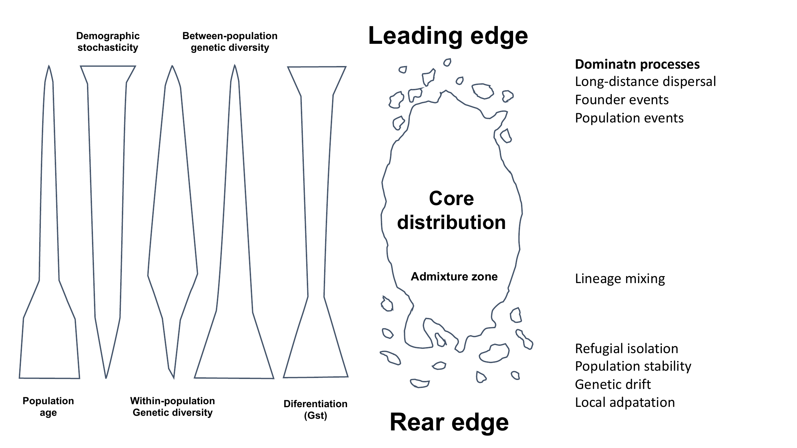
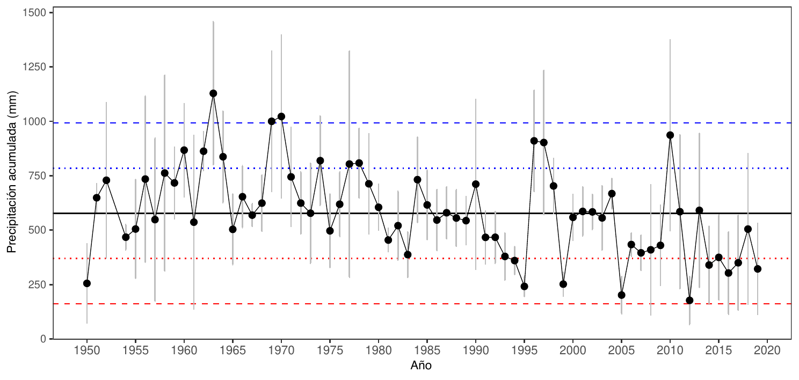
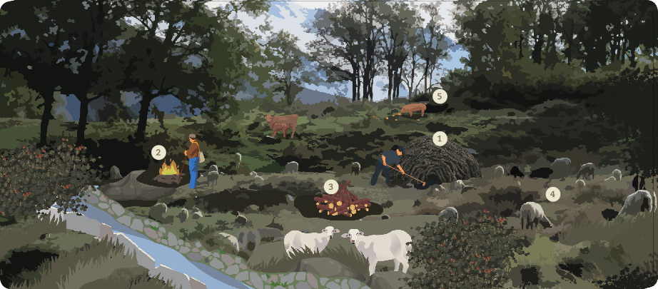

# Introducción General {#sec-intro}

## Vivir en los márgenes de distribución {#sec-intro-rear-edge}

La hipótesis Centro-Periferia (**CPH** de su siglas en inglés, *Centre-Periphery Hypothesis*) es un postulado biogeográfico que pretende explicar la variación de las características demográficas, genéticas y ecológicas de especies en sus áreas de distribución [@Sextonetal2009EvolutionEcology; @Pirononetal2015GeographicClimatic]. Esta hipótesis asume que el rango de distribución de una especie es una representación geográfica de su rango ecológico, y por tanto las condiciones ambientales son óptimas en el centro de su área de distribución y más severas en las regiones periféricas [@Pirononetal2017GeographicVariation] (@fig-intro-rear). Así, las poblaciones situadas en la periferia geográfica experimentan condiciones ecológicas (abióticas y/o bióticas) más desfavorables que conducen a menor densidad de población y eficacia ecológica [*fitness*, @Brown1984RelationshipAbundance]. A medida que se alcanzan los límites de los recursos ecológicos de las especies, las poblaciones se vuelven más pequeñas y más aisladas espacialmente, y tienden a perder variación genética [@Karketal2008HowDoes; @Garciaetal2010LivingEdge]. La hipótesis Centro-Periferia se ha utilizado ampliamente como base de diferentes hipótesis sobre procesos ecológicos y evolutivos, abordando desde el flujo genético entre poblaciones a otras cuestiones más aplicadas como la forma en la que las poblaciones responderán al cambio climático [@SagarinGaines2002AbundantCentre]. 

Tradicionalmente se ha considerado que las poblaciones situadas en los márgenes de su rango de distribución presentan un peor rendimiento, son más vulnerables, y presentan una baja diversidad genética, en comparación con las situadas en el centro de su distribución. Sin embargo, en los últimos años se ha observado cómo algunos rasgos funcionales (*e.g.* supervivencia, fecundidad) no siempre siguen las predicciones de esta hipótesis [@Pirononetal2017GeographicVariation]. Varios trabajos de revisión que realizan una compilación de estudios de ecología y evolución basados en el supuesto de la hipótesis centro-periferia, encontraron evidencias empíricas a favor de esta hipótesis en un 40-50% de los estudios analizados [@SagarinGaines2002AbundantCentre; @Pirononetal2017GeographicVariation]. @Eckertetal2008GeneticVariation, en una revisión de estudios sobre la variación genética entre las poblaciones periféricas y centrales de 115 especies, encontraron que el 64 % de los estudios presentaban el esperado declive en diversidad genética en las poblaciones situadas en los márgenes. Sin embargo, constataron que las diferencias genéticas en la mayoría de los estudios eran pequeñas, y sobre todo que los mecanismos que generan ese patrón no estaban claros.  
Éstas y otras revisiones [*e.g.*, @Abelietal2014EffectsMarginality], han puesto de manifiesto la existencia de numerosas excepciones a la hipótesis centro periferia, sobre todo en poblaciones de especies vegetales. Así por ejemplo, en especies forestales mediterráneas como *Pinus sylvestris*, se han observado tendencias de crecimiento mas positivas en poblaciones situadas en el límite inferior de su distribución que en las zonas centrales y en las zonas de latitudes mas al norte [@Matiasetal2017ContrastingGrowth]. Asimismo, estudios en poblaciones periféricas de haya (*Fagus sylvatica*) han revelado una mayor resiliencia y estabilidad frente a eventos de sequía [@VilaCabreraetal2019RefiningPredictions]. Por otro lado, varios estudios genéticos sobre *Quercus pyrenaica*, han puesto de manifiesto una mayor diversidad genética en las poblaciones localizadas en Sierra Nevada, uno de sus límites de distribución meridional, que en otras áreas situadas en el centro de su distribución [@ValbuenaCarabanaGil2013GeneticResilience; @ValbuenaCarabanaGil2017CentenaryCoppicing]. Por tanto, ante las numerosas excepciones a la hipótesis CPH, algunos autores han apuntado la necesidad de llevar a cabo una nueva redefinición de la teoría para explicar los efectos de la marginalidad en plantas y para identificar patrones generales [@Abelietal2014EffectsMarginality], y sobre todo, se ha señalado que se necesitan mas estudios que nos permitan una mejor comprensión de las dinámicas de las poblaciones situadas en los márgenes de su distribución [@VilaCabreraetal2019RefiningPredictions; @Jumpetal2010MonitoringManaging; @HampeJump2011ClimateRelicts; @Fadyetal2016EvolutionbasedApproach]. 

::: {#fig-intro-rear}
{width="100%"}

Representación esquemática de las poblaciones del frente de avance y de retroceso en respuesta al cambio climático. Varios autores sugieren que las poblaciones del borde posterior (*rear-edge*) pueden ser extremadamente importantes para la conservación a largo plazo de la diversidad genética, y por tanto es necesario prestarse especial atención a la modelización de los impactos del cambio climático sobre estas poblaciones. Dibujado a partir de [@HampePetit2005ConservingBiodiversity; @Woolbrightetal2014ClimateRelicts; @WillisBirks2006WhatNatural]
:::

Las poblaciones localizadas en el frente de retroceso [*rear-edge, sensu*, @HampePetit2005ConservingBiodiversity] son desproporcionadamente importantes para la conservación a largo plazo de la diversidad genética de la especie, así como para la historia filogeográfica y el potencial evolutivo de la especie [@HampePetit2005ConservingBiodiversity; @Woolbrightetal2014ClimateRelicts; @WillisBirks2006WhatNatural]. Comprender con detalle el funcionamiento de las poblaciones situadas en el frente de retroceso es esencial para su conservación, y para la compresión de las respuestas de las especies y poblaciones al cambio climático [@Jumpetal2010MonitoringManaging; @HampeJump2011ClimateRelicts; @Fadyetal2016EvolutionbasedApproach]. 

## ... y en zonas de montaña {#sec-intro-montana}

Las áreas montañosas albergan aproximadamente la mitad de los *hotspots* de biodiversidad del planeta [@SpehnKorner2009MountainLaboratory; @Kohleretal2014MountainsClimate]. En ellas se observa una alta diversidad de condiciones ambientales, debido principalmente a que presentan amplios gradientes climáticos en pequeñas escalas espaciales [@Kohleretal2014MountainsClimate; @Zamoraetal2021UniendoMacro]. Esto, unido a la alta sensibilidad y vulnerabilidad que presentan sus ecosistemas aislados geográfica y ecológicamente, hace que las áreas de montaña actúen como sistemas de alerta temprana de los impactos del cambio global [@KohlerMaselli2009MountainsClimate; @MacchiICIMOD2010MountainsWorld; @Zamoraetal2015HuellaCambio; @Zamoraetal2017MonitoringGlobal; @Priceetal2011MountainForests] considerándose laboratorios naturales donde estudiar los impactos del cambio global [@Zamora2010AreasProtegidas; @DoblasMirandaetal2015ReassessingGlobal; @Jumpetal2009AltitudeforlatitudeDisparity].
Algunas especies, tienen localizadas las poblaciones que constituyen los bordes traseros de su distribución en zonas de montaña. Estas poblaciones se sitúan en zonas con una alta heterogeidad de factores edáficos y topográficos, que parecen haber actuado como islas microclimáticas dentro de una región climática adversa, lo que ha sido de gran importancia para la persistencia de algunas especies [@MeineriHylander2017FinegrainLargedomain; @AbelSchaadetal2014PersistenceTree]. Por ejemplo en Sierra Nevada, la heterogeneidad climática y topográfica existente, ofrece una gran diversidad de microhábitats que ha permitido que esta región montañosa actúe como refugio de diferentes especies [@MedailDiadema2009GlacialRefugia; @GomezLunt2007RefugiaRefugia; @BlancoPastoretal2019TopographyExplains], incluso para especies de *Quercus* caducifolios durante el último periodo glacial [@Breweretal2002SpreadDeciduous; @Olaldeetal2002WhiteOaks; @RodriguezSanchezetal2010TreeRange].

En las regiones de montaña, además existen gradientes de escala más fina anidados dentro de cada montaña, que reproducen las condiciones de los bordes y del centro de distribución de las especies, haciendo muy complejas las interpretaciones de lo que ocurre con las especies que sitúan sus bordes de distribución en estas regiones, por lo que son zonas extremadamente importantes para su estudio [@Jumpetal2009AltitudeforlatitudeDisparity]. 

::: {#fig-intro-cambio-global}
{width="100%"}

Principales impactos del cambio global en Sierra Nevada una región montañosa del sur de la Península Ibérica. Fuente: [@Zamoraetal2015HuellaCambio].
:::

 

## ... y con cambio climático {#sec-intro-climate-change}

En la actualidad existen evidencias científicas de los efectos del cambio climático sobre los sistemas naturales [@IPCC2013ClimateChange]. Muchos procesos se están viendo alterados debido al cambio climático: cambios en el área de distribución de las especies [@Thuilleretal2005ClimateChange]; alteraciones fenológicas [@GordoSanz2005PhenologyClimate; @EstiartePenuelas2015AlterationPhenology], invasiones de especies [@GonzalezMorenoetal2014PlantInvasions], aumento en la severidad e incidencia de plagas forestales [@Hodaretal2012CambioClimatico; @HodarZamora2004HerbivoryClimatic], alteraciones en las interacciones ecológicas [@MontoyaRaffaelli2010ClimateChange], por citar algunos. Estos y otros cambios están modificando la composición, estructura y el funcionamiento de los ecosistemas, así como los bienes y servicios que éstos proporcionan [@Dingetal2016ValuingClimate]. Para la región Mediterránea, los efectos del cambio climático se espera que sean más severos que en otras regiones de la Tierra [@Giorgi2006ClimateChange; @IPCC2013ClimateChange] y en los ecosistemas forestales mediterráneos estos cambios tendrán impactos significativos [@Regato2008AdaptingGlobal; @RescodeDiosetal2006ClimateChange; @Penuelasetal2017ImpactsGlobal; @HerreroZavala2015BosquesBiodiversidad].  

En la región Mediterránea se ha registrado en las últimas décadas un aumento generalizado de las temperaturas, así como un cambio en los patrones de precipitación [@PerezBoscolo2010ClimateSpain; @GiorgiLionello2008ClimateChange; @Crameretal2020ClimateEnvironmental]. Para Sierra Nevada, usando datos datos de estaciones meteorológicas y mapas climáticos de alta resolución [@Benitoetal2014ClimateSimulations], también se han encontrado tendencias positivas para la temperaturas mínimas y máximas anuales, así como un patrón generalizado de reducción de la precipitación anual desde la década de 1960 [@PerezLuqueetal2016SenalesCambio; @PerezLuqueetal2021ClimaNevadaBase].  

Una de las característica del cambio climático, además del aumento en las temperaturas y el cambio en el régimen de precipitaciones, es el aumento de los eventos extremos, tales como sequías, tormentas, inundaciones, etc. [@IPCC2013ClimateChange]. A pesar de que la sequía es una característica del clima mediterráneo [@Lionello2012], en las últimas décadas se ha registrado un incremento en la duración, frecuencia y severidad de los eventos de sequía [@LloydHughesSaunders2002DroughtClimatology; @Sousaetal2011TrendsExtremes; @Colletal2017DroughtVariability], particularmente en el sur de Europa [@VicenteSerranoetal2014EvidenceIncreasing; @Staggeetal2017ObservedDrought; @Spinonietal2015EuropeanDrought; @Pascoaetal2017DroughtTrends], donde además se ha observado una tendencia hacia veranos más secos [@Spinonietal2017PanEuropeanSeasonal] (@fig-intro-sequia). Este hecho cobra especial relevancia para el área Mediterránea, considerada una de las más vulnerables frente al cambio climático [@Giorgi2006ClimateChange], ya que las proyecciones a futuro pronostican un aumento de la severidad de los eventos climáticos extremos extremos [@Hoerlingetal2012IncreasedFrequency; @IPCC2013ClimateChange; @Trenberthetal2014GlobalWarming; @Spinonietal2018WillDrought].  

::: {#fig-intro-sequia}
{width="100%"}

Evolución temporal de la precipitación acumulada (año hidrológico) durante el periodo 1950-2020 para Sierra Nevada (datos procedentes de 28 estaciones meteorológicas). Los puntos representan la media y las barras de error, el error estándar. La línea negra indica la precipitación acumulada media para todo el periodo (585 mm). Las líneas rojas representan -1 y -2 desviaciones estándar (líneas punteadas y discontinuas respectivamente). Las líneas azules representan +1 y +2 desviaciones estándar (líneas punteadas y discontinuas, respectivamente). Datos de [@PerezLuqueetal2021ClimaNevadaBase]
:::

El incremento en la frecuencia y severidad de las sequías está alterando el funcionamiento de los ecosistemas mediterráneos a diferentes escalas [@Penuelasetal2017ImpactsGlobal; @Forneretal2018ExtremeDroughts; @Liuetal2020EffectsDecadal; @OgayaPenuelas2021ClimateChange], puesto que la sequía afecta a aspectos fisiológicos, funcionales, estructurales y demográficos de los ecosistemas forestales [@Allenetal2010GlobalOverview; @Assaletal2016SpatialTemporal]. No obstante, se están observando respuestas diferenciales de los ecosistemas forestales a la sequía [@Andereggetal2020DivergentForest], poniendo de manifiesto la importancia de otros aspectos como el momento en el que ocurre la sequía [@Huangetal2018DroughtTiming]. Esto es de especial relevancia para especies de frondosas como el *Quercus pyrenaica* que presenta una fenología de crecimiento bien marcada [@PerezdeLisetal2016ChangesSpring]. 

*Q. pyrenaica* presenta una alta vulnerabilidad al cambio climático en la Península Ibérica [@GarciaValdesetal2013ChasingMoving; @BenitoGarzonetal2008EffectsClimate; @Benitoetal2011SimulatingPotential], lo cual es particularmente importante en las zonas más cálidas de su distribución [@GeaIzquierdoCanellas2014LocalClimate]. Las simulaciones basadas en modelos de distribución de especies pronostican un potencial desplazamiento del área de distribución, así como una disminución en la idoneidad del hábitat para esta especie [@Mateoetal2010EffectsNumber; @BenitoGarzonetal2008EffectsClimate; @Felicisimo2011ImpactosVulnerabilidad; @Felicisimoetal2012VulnerabilidadFlora; @RuizLabourdetteetal2011ForestComposition; @Urbietaetal2011MediterraneanPine; @Benitoetal2011SimulatingPotential], que potencialmente puede suponer una reducción en la superficie ocupada a consecuencia del aumento de temperatura pronosticado [@BenitoGarzonetal2008EffectsClimate; @Benitoetal2011SimulatingPotential]. Esto es particularmente importante para Sierra Nevada, donde además de la disminución del área de ocupación se prevé una migración altitudinal [@Benitoetal2011SimulatingPotential; @Benito2009EcoinformaticaAplicada], así como un aumento de la competencia con otras especies, ya que las zonas actualmente ocupadas por los robledales en Sierra Nevada serán óptimas para los encinares [@Benitoetal2011SimulatingPotential].

## ... y con cambios de uso {#sec-intro-land-use}

A menudo se pasa por alto que la actividad humana constituye un impulsor de cambio tan poderoso o incluso más que los impulsores naturales (*i.e.*, la variación natural del clima), en particular para las regiones con una larga historia de manejo, como la región Mediterránea [@NavarroGonzalezetal2013WeightLanduse; @DoblasMirandaetal2017ReviewCombination]. En estas zonas, la susceptibilidad y la respuesta de los ecosistemas al cambio climático están condicionadas por los legados del uso del suelo [@Munteanuetal2015Legacies19th; @Mausolfetal2018LegacyEffects]. Los legados del uso pasado, interactúan con las perturbaciones climáticas recientes causadas por el hombre y pueden confundir su interpretación [@Fosteretal2003ImportanceLanduse]. Esto es importante ya que en la Península Ibérica se ha constatado que una cuarta parte de los bosques actuales crecen en antiguos terrenos agrícolas y de pastoreo abandonados después de la década de 1950 [@VilaCabreraetal2017NewForests]. En consecuencia, la modificación antropogénica del hábitat y sus legados representan una dimensión crítica para las poblaciones situadas en su borde de distribución, ya que pueden intensificar, enmascarar o retrasar el declive poblacional impulsado por el clima en estas zonas [@VilaCabreraJump2019GreaterGrowth; @SanchezdeDiosetal2020FagusSylvatica]. 

::: {#fig-intro-usos}
{width="100%"}

Principales usos antrópicos del robledal. Pilas de leña para carboneo tradicional (1); quemas para la creación de áreas de pastoreo y cultivos (2); leñas para uso doméstico (3); pastoreo (4); y producción de bellotas (5). [Fuente:, @PerezLuqueetal2021ManualGestion]
:::

Los robledales de *Q. pyrenaica*, al igual que otras formaciones forestales, han sido objeto de intensas presiones de origen antrópico que han provocado la reducción de su área de distribución, así como la modificación en sus patrones florísticos y estructurales [@Gavilanetal2000EffectsDisturbance; @Gavilanetal2007ModellingCurrent; @Tarregaetal2006ForestStructure]. Históricamente se han explotado en monte bajo para la obtención de leñas, carbón, taninos y producción de casca [@RuizdelaTorre2006FloraMayor]. También se han llevado a cabo clareos para crear pastos con bajas densidades de árboles maduros que proporcionan bellotas, leñas y amplias áreas para el pastoreo; e incluso a veces se quemaban para crear áreas de pastoreo [@ValbuenaCarabanaGil2017CentenaryCoppicing]. De hecho, el sobrepastoreo en estas formaciones provocaba unas importantes pérdidas de suelo, aspecto que se viene señalando por los gestores forestales desde final del siglo XIX [@Laguna1872ComisionFlora]. Todos estos procesos antropogénicos han transformado tanto las estructuras de los robledales, que es difícil encontrar rodales que puedan considerarse como bosques naturales [@RuizdelaTorre2006FloraMayor]. Esta presión antrópica también se ha observado en los robledales de Sierra Nevada [@JimenezOlivencia1991PaisajesSierra], donde el intenso aprovechamiento ganadero y forestal, la roturación de espacios para nuevos cultivos y pastos, la explotación de leña para uso doméstico o industrial, e incluso los incendios forestales, han ocasionado la reducción de la superficie que ocupaban estas formaciones [@CamachoOlmedoetal2002AltaAlpujarra] (@fig-intro-usos). Así, por ejemplo, el melojar de la Solana de la Dehesa de San Jerónimo, sufrió una tala masiva en la posguerra para utilizar la leña como gasógeno para los automóviles [@Prieto1975BosquesSierra]. En algunas zonas de Sierra Nevada, la presión antrópica ha sido tan intensa, que se perdió por completo la cubierta forestal, ocasionando graves problemas de erosión [@MesaGarrido2019ReforestacionSilvicultura; @RomeroZurbano1909DivisionHidrologicoforestal]. Todas estas actuaciones condujeron a una sobreexplotación de los robledales cuya configuración actual en Sierra Nevada parece depender, al igual que otras formaciones vegetales, del uso del pasado [@NavarroGonzalezetal2013WeightLanduse]. Sin embargo, a partir de la segunda mitad del siglo XX se produjo un abandono rural que produjo una disminución de la presión antrópica sobre los ecosistemas forestales. Es por ello que analizar la dinámica de los robledales frente a los cambios de uso del suelo resulta crucial dada la importancia que tiene el uso del pasado en la configuración actual de estos ecosistemas, más teniendo en cuenta que representan uno de los bordes mas meridionales de su distribución. 

## Problemas de conservación del robledal en el borde de su distribución {#sec-intro-problemas}

Las principales amenazas que sufren los melojares parecen estar relacionadas con las transformaciones productivas y de usos del suelo generadas por los intensos cambios socioeconómicos ocurridos durante las últimas décadas [@Vericatetal2012GestionAdaptativa; @PiqueVericat2015EvolutionPerspectives]. Este conjunto de efectos se ha convertido en el principal agente transformador de los melojares, que además pueden actuar de forma sinérgica con los impactos derivados del cambio climático. La sustitución de los robledales en el pasado por cultivos y pastos relegó al robledal a las laderas y pendientes más inclinadas [@GarciaJimenez20099230Robledales; @BlancoCastroetal2005BosquesIbericos; @JimenezOlivenciaetal2015EvolucionUsos; @Allue1997GestionRobledales]. El abandono de los usos forestales tradicionales ha provocado posteriormente una acumulación de biomasa en el monte que incrementa la vulnerabilidad y la sensibilidad de estas formaciones ante los incendios forestales [@GarciaJimenez20099230Robledales; @Allue1997GestionRobledales; @Calvoetal1999PostfireSuccession]. Por otro lado, debido a la gran capacidad de recuperación que presenta esta especie frente a perturbaciones puntuales (como un incendio) [@Calvoetal1999PostfireSuccession; @Calvoetal2003RegenerationWildfire], el riesgo de sufrir incendios recurrentes aumenta debido a la acumulación de altas densidades de biomasa aérea [@Canellasetal2004GrowthResponse; @Canellasetal2008SilvicultureCarbon].

Otras amenazas específicas sobre los melojares están relacionadas con los problemas de regeneración y baja supervivencia de las plántulas. Tradicionalmente se ha asumido que los robledales, debido a su debilitado estado de salud, producen pocas bellotas. De hecho, se han aclarado las masas con el objetivo de reducir la competencia por los recursos y mejorar el estado de la masa [@Canellasetal2004GrowthResponse; @Aldeaetal2017ThinningEnhances; @MorenoFernandezetal2020InfluenceClimate], lo cual puede derivar en una mayor capacidad de reproducción y de producción de bellota [@Bravoetal2008SelviculturaMontes]. Sin embargo, se ha visto en algunas especies congéneres que estos efectos se mantienen solo en el corto plazo [@SanchezHumanesEspelta2011IncreasedDrought], y que incluso pueden llegar a producir una disminución de la producción de bellota [@Martiniketal2017EffectThinning].

Los robledales, al igual que otras especies del género *Quercus*, también sufren la incidencia de plagas forestales, entre las que destaca el complejo de lepidótperos defoliadores. Este complejo que alberga a mas de 50 especies de diferentes familias de lepidótperos [@Soria1988RelacionLepidopteros; @Soria1987LepidopterosDefoliadores], debilita el estado de salud de las masas forestales, afectando también a la producción de bellota. En Sierra Nevada, se han detectado mas de 25 especies de este complejo defoliador (J.M. Muñoz *com. pers.*), comportándose algunas como plagas en determinados años (*e.g. Lymantria dispar, Tortrix viridiana*).  

La dispersión de las bellotas se realiza principalmente por parte del arrendajo (*Garrulus glandarius*). En Sierra Nevada, se ha observado un descenso en la densidad de este córvido, pasando de 6.6 ind/10 ha en los años 80 a 1.25 ind/10 ha en la actualidad [@ZamoraBareaAzcon2015LongtermChanges]. Las bellotas de roble melojo son consumidas por varias especies de vertebrados como el ratón de campo (*Apodemus sylvaticus*), el jabalí (*Sus scrofa*) o el ganado doméstico [@Pereaetal2014InteraccionesPlantaanimal; @Gomezetal2001ProblemasRegeneracion], que actúan en diferentes microhábitats. Por ejemplo, los jabalís prefieren los espacios abiertos mientras que los ratones consumen selectivamente las bellotas situadas debajo de los arbustos, por lo que disminuyen los lugares seguros para el reclutamiento [@Gomez2003ImpactVertebrate]. 

La sequía estival junto con los daños causados por los ungulados provocan una considerable mortalidad de plántulas y juveniles de esta especie [@Pereaetal2014InteraccionesPlantaanimal; @Barazaetal2004HerbivoryHas]. Las plántulas emergidas sufren unas altas tasas de mortalidad, debidas fundamentalmente al pisoteo y al consumo por parte de vertebrados como jabalíes, ratones y liebres [@Pereaetal2014InteraccionesPlantaanimal; @Gomez2003ImpactVertebrate]. Por otro lado, la herviboría también se ve condicionada por las diferencias en las características químicas de las plántulas de especies arbóreas, propiciando un consumo diferencial por parte de los ungulados [@Baraza2005EfectoPequenos; @Barazaetal2007InfluenciaCaracteristicas; @Barazaetal2004HerbivoryHas]. En Sierra Nevada, el roble y el arce (*Acer opalus* subsp. {granatensis}) presentan una alta calidad nutritiva en comparación con otras especies forestales con las que conviven (*e.g* pino albar, pino salgareño y encina), lo que supone una alta probabilidad de consumo, incluso cuando son juveniles. Además, el efecto de la herbivoría sobre la regeneración del roble, y de otras especies forestales, depende, también de la frecuencia y severidad con la que son ramoneados los individuos (juveniles), y de la capacidad de tolerancia que presentan. Así los juveniles de las especies con mayor probabilidad de consumo (menos resistentes), muestran una mayor recuperación tras la herbivoría (tolerancia) respecto a las especies menos palatables [@Barazaetal2007InfluenciaCaracteristicas].   

Otro factor a tener muy en cuenta respecto al reclutamiento del robledal es la intensidad y duración de la sequía estival. Se ha comprobado que el roble junto con la encina son las especies que presentan mayor probabilidad de reclutamiento en veranos secos [@Mendozaetal2009SeedingExperiment]. Asimismo, cuando ocurren veranos más húmedos, aumenta drásticamente la supervivencia del banco de plántulas de roble [@Mendozaetal2009SeedingExperiment]. 

### Conservación de los robledales {#sec-intro-conservation}

*Q. pyrenaica* está incluida con la categoría de *"Preocupación menor"* en la Lista Roja de Especies Amenazadas de la IUCN [@Goreneretal2017QuercusPyrenaica], así como en la Lista Roja Europea de Árboles [@Riversetal2019EuropeanRed]. En algunos catálogos autonómicos aparece con diferentes grados de protección. En Andalucía, se consideró como Vulnerable con riesgo menor pendiente de conservación [@Viveroetal2000QuercusPyrenaica]. Asimismo se incluye en la Lista Roja de la Flora Vascular de Andalucía bajo la categoría *"NT"* (Casi Amenazada) [@Cabezudoetal2005ListaRoja]. Finalmente, en Sierra Nevada siguiendo criterios UICN se ha catalogado como de menor riesgo, dependiente de la conservación (LRcd) [@Blancaetal1998ThreatenedVascular; @Blancaetal2001VegetacionSierra; @Lorite2016UpdatedChecklist; @Loriteetal2007EstimationThreatened]. 

Los bosques de *Q. pyrenaica* están protegidos a nivel europeo por la Directiva Hábitats (92/43/CEE) (en el anexo I como *"9230 Robledales galaico-portugueses con Quercus robur y Quercus pyrenaica"*) e incluidos en la Red Natura 2000. Aparecen en diferentes esquemas de clasificación de hábitats:
- EUNIS Hábitat Classification [@Daviesetal2004EUNISHabitat]: G1.7B4 Baetic [*Quercus pyrenaica*] forests
- Paleartic Habitat Classification 1996 [@DevillersDevillersTerschuren1998ClassificationPalearctic]: 41.6 *Quercus pyrenaica* forests 

El 18.41% de la distribución actual de los melojares en España aparece bajo algún nivel de protección ya que se encuentran en diversos espacios naturales protegidos. Asimismo aparece en la Lista Patrón de Hábitats Terrestres como *41.64 Bosques béticos de Quercus pyrenaica.*

## Conocimiento de la dinámica de los robledales en el borde de su distribución {#sec-intro-conocimiento}

Los robledales de Sierra Nevada han sido objeto de numerosos estudios, predominando los de índole ecológico y fitosociológico. Se han realizado trabajos de caracterización de los robledales desde un punto de vista fitosociológico, llevando a cabo clasificaciones basadas en la composición y abundancia de especies [@MartinezParrasMoleroMesa1982EcologiaFitosociologia; @Loriteetal2008PhytosociologicalReview; @MelendoValle2000EstudioComparativo]. Asimismo, se ha abordado diferentes aspectos ecológicos, como por ejemplo (por citar algunos): efecto de la herbivoría en el reclutamiento [@Gomez2003ImpactVertebrate; @Barazaetal2004HerbivoryHas; @Barazaetal2007InfluenciaCaracteristicas]; el reclutamiento bajo diferentes escenarios de sequía [@Mendozaetal2009SeedingExperiment]; la evaluación de las respuestas de los juveniles a diferentes escenarios lumínicos [@GomezAparicioetal2008OakSeedling]; la evaluación de la supervivencia de juveniles por encima del límite del árbol [@Leverkusetal2015RestoringPresent]. Por otro lado también se han abordado estudios genéticos de los diferentes tipos de robledales [@ValbuenaCarabanaGil2011EvaluacionEstructura; @ValbuenaCarabanaGil2013GeneticResilience; @ValbuenaCarabanaGil2017CentenaryCoppicing], así como estudios de la microbiota de estas formaciones [@CoboDiazetal2017TaxonomicFunctional; @Lasaetal2019BacteriaEndosphere; @Lasaetal2019MetabarcodingReveals]. Otros trabajos han evaluado el funcionamieno de estas formaciones usando indices derivados de teledetección [@Dionisioetal2012SatelliteBasedMonitoring; @AlcarazSeguraetal2015CambiosProductividad; @RequenaMulloretal2018AssessmentEcosystem], así como las tendencias de crecimiemto usando metodos dendrocronológicos  [@GeaIzquierdoCanellas2014LocalClimate; @RubioCuadradoetal2018AbioticFactors]. Destacán también los estudios de cambio de uso [@JimenezOlivenciaetal2015EvolucionUsos; @CamachoOlmedoetal2002DinamicaEvolutiva], y aquellos donde se propone la utilización de plantas nodrizas para la restauración de robledales [@Castroetal2006RestoringQuercus; @GomezAparicioetal2004ApplyingPlant]. 
Éstos y otros estudios, han aportado una valiosa información sobre aspectos concretos de la ecología y el funcionamiento de los robledales. No obstante, en este memoria doctoral, pretendemos aumentar ese conocimiento centrándonos en varios aspectos relacionados con la dinámica de funcionamiento de esta formación frente al cambio global (cambios de uso y cambio climático) en el límite sur de su distribución.    

## Objetivos {#sec-intro-objetivos}

Así pues el **objetivo** general de esta memoria doctoral es analizar la dinámica de funcionamiento frente al cambio global de los robledales de *Q. pyrenaica* situados en Sierra Nevada, una región montañosa que representa uno de los límites geográficos de su distribución, donde estas formaciones han sido objeto de intensas presiones antrópicas. 

Los objetivos específicos son: 

#### *Caracterizar los robledales de Sierra Nevada desde un punto de vista ambiental*

Bajo la hipótesis de que las poblaciones del límite sur de distribución geográfica de *Q. pyrenaica* localizadas en zonas de montaña son representativas de diferentes condiciones ambientales a escala local debido a los fuertes gradientes topográficos existentes, queremos analizar si las poblaciones de robledal de Sierra Nevada habitan en condiciones similares, y hasta qué punto la variabilidad ambiental se corresponde con diversidad florística. En este sentido, pretendemos: *(i)* determinar las variables ambientales que mejor explican la distribución de las poblaciones de melojo en Sierra Nevada; *(ii)* identificar grupos de poblaciones de robledal en función de la composición florística y las condiciones ambientales; y *(iii)* analizar si la agrupación de las poblaciones de melojo en función de las variables ambientales coincide con su agrupación en función de la composición florística.

#### *Analizar el proceso de colonización de hábitats degradados próximos a las masas de robledal en Sierra Nevada*

Tras el abandono de actividades tradicionales, queremos analizar el proceso de colonización de hábitats degradados (campos de cultivo abandonados) próximos a los robledales y explorar si existen diferencias entre las poblaciones en el límite sur de su distribución. 

#### *Cuantificar el papel de los robledales de Sierra Nevada como sumidero de carbono y analizar su tendencia temporal*

El secuestro de carbono es uno de los servicios ecosistémicos más relevantes que proporcionan los bosques mediterráneos, siendo un indicador de la capacidad del ecosistema para contribuir a la regulación del clima. Los robledales, como ecosistemas mediterráneos representan un sumidero de carbono. El objetivo de este capítulo es cuantificar la capacidad  de secuestro de carbono de los robledales de Sierra Nevada, situados en el borde de su distribución, explorando las posibles diferencias entre las poblaciones de robledal dentro de esta región montañosa. Asimismo estamos interesados en analizar la evolución temporal de este servicio ecosistémico 

#### *Analizar los efectos del cambio climático en la productividad de los robledales en Sierra Nevada*

Pretendemos evaluar cómo las alteraciones en los patrones de disponibilidad hídrica debido al cambio climático pueden afectar a la productividad de esta formación forestal. Sabemos que los robledales presentan una estación de crecimiento bien definida y centrada en la estación estival. Por ello es de interés evaluar la productividad de los robledales (utilizando índices de vegetación obtenidos a partir de imágenes de satélite) frente a cambios en los patrones de disponibilidad hídrica. Nos centraremos en analizar modificaciones en la cantidad de agua (disminución de la disponibilidad de agua debido a eventos de sequía) así como alteraciones en la distribución temporal de la disponibilidad de agua (*p.ej.*: adelantos en la fusión de la cubierta de nieve).

#### *Evaluar la resiliencia de los robledales en su borde de distribución frente a eventos de sequía*

El cambio global supone un reto para los ecosistemas forestales localizados en el límite de su distribución debido a su vulnerabilidad a los eventos de sequía. Nuestro objetivo es analizar la resiliencia a varios eventos de sequía de las poblaciones relictas de *Q. pyrenaica* situadas en Sierra Nevada. Para ello, combinaremos información de teledetección y métodos dendroecológicos para evaluar el impacto de la sequía tanto en el verdor de la vegetación (como indicador del crecimiento primario) como en el crecimiento radial de los árboles (como indicador del crecimiento secundario).

#### *Identificar y cuantificar los servicios ecosistémicos proporcionados por los robledales en Sierra Nevada*

Realizaremos una revisión de los principales servicios ecosistémicos proporcionados por los robledales combinando revisiones bibliográficas con conocimiento experto y datos de Sierra Nevada, con el objetivo de poner de relieve los diferentes servicios ecosistémicos que proporcionan estas formaciones para incorporarlas a las estrategias de gestión de estos ecosistemas.
