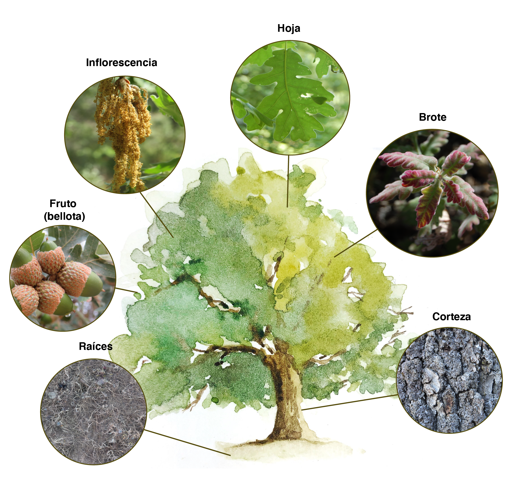
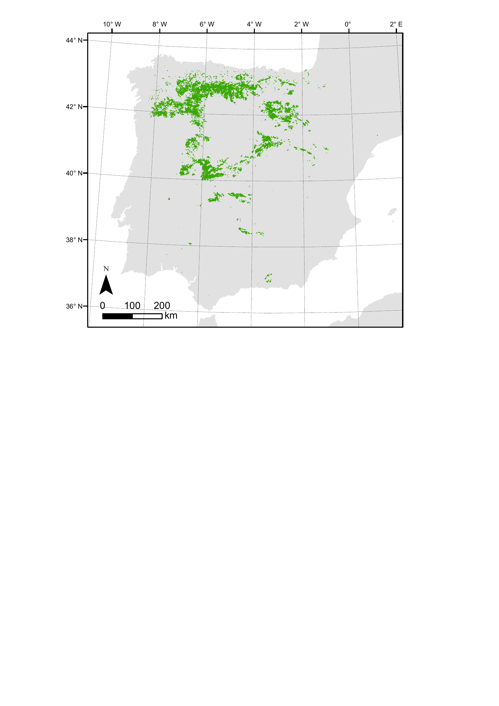
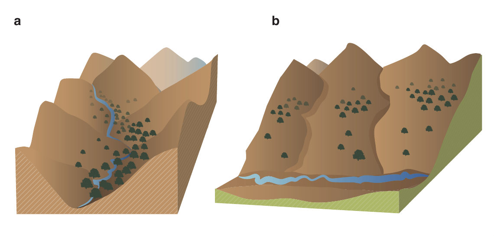
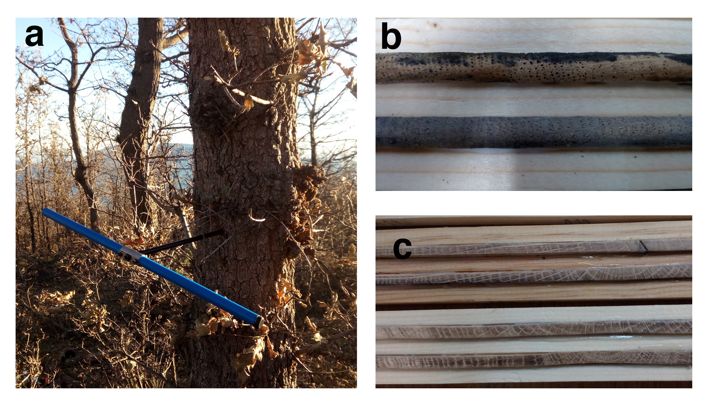

# Metodología general {#sec-metodologia}

## El roble melojo {#sec-metodologia-qp}

*Quercus pyrenaica* Willd. es un árbol caducifolio de hojas marcescentes que alcanza hasta 20-25 m, de copa amplia (@fig-metodologia-features-qp). La corteza es cenicienta o pardo-grisácea, gruesa y agrietada. El tronco aparece muchas veces tortuoso. Ramillas pardas cuando jóvenes, después grisáceas, tomentosas. Presenta un sistema radical muy potente con numerosas raíces horizontales, superficiales, copiosamente estoloníferas, que dan lugar a la formación de matas periféricas tapizantes. Hojas pinnatífidas o pinnatipartidas, de base truncada o cordada; las adultas de haz verde y glabrescente y envés densamente tomentoso, con los pelos estrellados, que a menudo se mantienen marchitas y sin caer durante gran parte del invierno. Flores unisexuales; las masculinas en amentos laxos, colgantes, con perianto de lóbulos hirsutos y estambres expertos; las femeninas con estilos en el interior de un involucro de numerosas escamas (cúpula), en grupos raciformes de 1 a 4, sentadas o cortamente pedunculadas. Fruto en aquenio (bellota), envuelto por la cúpula en su parte basal, solitario o en grupos de 2-3, de color pardo-amarillento. Florece en abril y mayo; las bellotas maduran en noviembre y diciembre del mismo año.

{#fig-metodologia-features-qp width="100%"}

Los robledales de roble melojo o melojares son formaciones dominadas por *Quercus pyrenaica* Willd. que se distribuyen desde el suroeste de Francia hasta el noreste de Marruecos, ocupando su mayor extensión en la Península Ibérica, donde abarcan una amplia variedad de sitios y nichos ecológicos (@fig-metodologia-distroble) [@NietoQuintanoetal2016QuercusPyrenaica; @GarciaJimenez20099230Robledales; @VilchesdelaSerna2014ComprehensiveStudy; @delaSernaetal2016MarcescentQuercus]. Según el Inventario Forestal Nacional [@Villanueva2005TercerInventario], estas formaciones ocupan 845 511 ha, lo que supone aproximadamente el 5% de la superficie forestal de España.

{#fig-metodologia-distroble width="75%"}

Esta especie requiere de un mínimo de humedad estival para sobrevivir, que algunos autores han estimado en al menos 100 mm de precipitación entre mayo y agosto [@BlancoCastroetal2005BosquesIbericos; @Prieto1975BosquesSierra]. En Sierra Nevada el aporte extra de humedad necesario proviene de dos vías: de los ríos y acequias de careo, o del aire húmedo proveniente del Mediterráneo [@PrietoEspinosa1977AestisilvaSierra; @MartinezParrasMoleroMesa1982EcologiaFitosociologia; @PerezRayaetal1990VegetacionSierra]. En efecto, los melojares en Sierra Nevada aparecen en aquellos enclaves más húmedos y de menor índice de insolación, principalmente barrancos y fondos de valle donde se dan unas condiciones microclimáticas favorables, tal y como ocurre en la zona occidental en orientaciones norte (ríos Alhama de Lugros, Maitena, Vadillo, Genil, Monachil, Dílar y Dúrcal) (@fig-metodologia-disposicion panel a); o situados ocupando una determinada altura en la vertiente sur (Alpujarras: loma de Cáñar, barranco del Poqueira, loma de Pitres-Busquístar) en donde actúan como una banda de vegetación que intercepta la humedad procedente del Mediterráneo [@Lorite2001VegetacionSierra; @PrietoEspinosa1977AestisilvaSierra] (@fig-metodologia-disposicion panel b). Estas diferencias también tienen reflejo en la composición florística de las poblaciones de ambas vertientes [@Loriteetal2008PhytosociologicalReview; @MelendoValle2000EstudioComparativo].

{#fig-metodologia-disposicion width="100%"}

## Área de estudio {#sec-metodologia-sn}

Sierra Nevada es una región montañosa situada en el sur de Europa, que ocupa más de 2 000 km^2^ (@fig-metodologia-mapa-sn). Presenta un rango altitudinal que varía entre 860 y 3 482 m, incluyendo la cumbre más alta de la Península Ibérica (Mulhacén). El clima es mediterráneo, caracterizado por inviernos fríos y veranos calurosos, con una pronunciada sequía estival. La temperatura media anual desciende en altitud desde los 12-16ºC por debajo de los 1 500 m hasta los 0ºC por encima de los 3 000 m de altitud. La precipitación media anual es muy irregular, con valores que oscilan entre los 250 y los 700 mm anuales, dependiendo principalmente de la altitud y de la compleja orografía [@PeinoCalero2020AnalisisVariabilidad; @PerezLuqueetal2021ClimaNevadaBase]. Las precipitaciones invernales son principalmente en forma de nieve por encima de los 2 000 m de altitud [@PerezPalazonetal2015ExtremeValues]. Geológicamente, la zona central está compuesta por rocas silíceas, principalmente micaesquistos, rodeadas de calizas y dolomías [@RodriguezFernandez2017ParqueNacional]. Esta región montañosa alberga un total de 2 353 taxones de plantas vasculares, representando el 33% y el 20% de la flora de España y de Europa respectivamente [@Lorite2016UpdatedChecklist]. Además presenta una alta tasa de endemicidad con 95 taxones vegetales endémicos [@Loriteetal2007EstimationThreatened; @Loriteetal2020FloraSNevadaTrait]. La cubierta forestal de Sierra Nevada está dominada por plantaciones de pino (*Pinus halepensis* Mill., *P. pinaster* Ait., *P. nigra* Arnold subsp. *salzmannii* (Dunal) Franco, y *P. sylvestris* L.) que cubren aproximadamente 37 000 ha. Los bosques autóctonos están dominados principalmente por la encina (*Quercus ilex* subsp. *ballota* (Desf.) Samp.) ocupando zonas de baja y media montaña (11 000 ha) y el roble melojo (*Quercus pyrenaica* Willd.) que va desde los 1 100 a los 2 000 m, cubriendo unas 3 400 ha [@Lorite2001VegetacionSierra; @PerezLuqueetal2019MapEcosystems].

{#fig-metodologia-mapa-sn width="99%"}

Sierra Nevada contiene 27 hábitats tipo incluidos en la Directiva Hábitats, 28 especies de aves del Anexo I de la Directiva Aves y 15 especies de animales incluidas en el Anexo II de la Directiva Hábitats (1 reptil, 2 anfibios, 7 mamíferos y 5 invertebrados). Todo ello hace que esté considerada como uno de los *hotspots* de biodiversidad más importantes en la Región Mediterránea [@Blanca1996ProteccionFlora; @Blancaetal1998ThreatenedVascular; @MedailQuezel1999BiodiversityHotspots; @Canadasetal2014HotspotsHotspots]. En Sierra Nevada hay 61 municipios con un total de mas de 90 000 habitantes, siendo sus principales actividades económicas la agricultura, el turismo, la ganadería, la apicultura, la minería, y el esquí [@FernandezMarquezSalinas2009ImpactoSocioeconomico]. El alto valor de biodiversidad y geodiversidad, así como su riquerza paisajística y cultural han hecho que Sierra Nevada presente varios reconocimientos y cuente con diversas figuras legales de protección. Además de contar con un Parque Nacional y un Parque Natural, Sierra Nevada es una Reserva de la Biosfera (MaB, Unesco). Está incluida en la red Natura 2000 como Zona de Especial Protección para las Aves y Lugar de Interes Comunitario (LIC).

Una de las características más importantes de Sierra Nevada es la existencia de marcados gradientes altitudinales, ecológicos y climáticos [@Zamoraetal2021UniendoMacro]. Así por ejemplo, existe un fuerte contraste climático entre las laderas soleadas y secas orientadas al sur, y las laderas sombreadas y más húmedas orientadas al norte. La heterogeneidad climática y topográfica existente en Sierra Nevada ofrece una gran diversidad de microhábitats, lo que ha permitido a esta región montañosa actuar como refugio de diferentes especies [@MedailDiadema2009GlacialRefugia; @GomezLunt2007RefugiaRefugia; @BlancoPastoretal2019TopographyExplains], incluyendo especies caducifolias de *Quercus* durante la última glaciación [@Olaldeetal2002WhiteOaks; @RodriguezSanchezetal2010TreeRange; @Petitetal2002IdentificationRefugia].

La existencia de estos gradientes confiere a Sierra Nevada, y a las regiones montañosas en general, el carácter de un excepcional laboratorio natural de seguimiento del cambio global [@Zamora2010AreasProtegidas; @Zamoraetal2017MonitoringGlobal]. De hecho, en 2008 se estableció el Observatorio de Cambio Global de Sierra Nevada (OBSNEV) (https://obsnev.es), un programa de seguimiento a largo plazo para evaluar el impacto del cambio global en los ecosistemas nevadenses [@Aspizuaetal2010ObservatorioCambio; @BonetGarciaetal2011SierraNevada]. Esta iniciativa está recopilando información útil y relevante sobre los efectos del cambio global en los sistemas socieoecológicos de Sierra Nevada [@Zamoraetal2015HuellaCambio; @Zamoraetal2017GlobalChange; @PerezLuqueetal2016SenalesCambio; @RamosLosadaetal2017TenYears]. Asimismo, y relacionado con la temática de la presente memoria doctoral, dentro de las metodologías de seguimiento de esta iniciativa, se vienen realizando diferentes análisis sobre los efectos del cambio global en las masas de robledal [ver por ejemplo @BonetGarciaetal2015ImpactosCambio; @Aspizuaetal2012EvaluacionGestion; @Munoz2012BosquesAutoctonos].

### Melojares en Sierra Nevada {#sec-metodologia-qpsn}

En Sierra Nevada, los melojares ocupan actualmente una extensión de 3 400 ha [@PerezLuqueetal2019MapEcosystems], distribuidas entre los 1 000 y 2 000 , y situados exclusivamente sobre suelos silíceos. Aunque representan menos del 7% de la superficie forestal existente en Sierra Nevada (@fig-metodologia-mapa-snc), tienen una alta singularidad ecológica y presentan una alta diversidad de especies vegetales en comparación con las otras formaciones forestales [@GomezAparicioetal2009ArePine; @PerezLuqueetal2014SinfonevadaDataset]. Además, albergan diferentes especies vegetales consideradas relictas [@Loriteetal2008PhytosociologicalReview; @Blancaetal1998ThreatenedVascular] (Ver apéndice @sec-appendix-multivar).

## Análisis del patrón de colonización de cultivos abandonados {#sec-metodologia-coloniza}

En el capítulo @sec-coloniza se estudia el patrón de colonización de los cultivos de montaña abandonados. La aproximación que utilizamos consistió en el estudio de los diferentes módulos implicados en la dispersión [@LundbergMoberg2003MobileLink; @Nathanetal2012DispersalKernels], a saber: fuente semillera (bosques de *Quercus pyrenaica*); vector de dispersión (animales dispersores de bellotas); y sumidero receptor de semillas (cultivos abandonados).

Se seleccionaron 5 cultivos abandonados situados en dos localidades de Sierra Nevada que representan las dos vertientes: robledal de San Juan (Robledal del río Genil; oientación NW); y robledal de Cáñar (orientación sur). Para cada uno de los cultivos abandonados, se llevó a cabo un análisis de la estructura forestal circundante y del patrón de regeneración. Para ello se distribuyeron al azar transectos lineales de vegetación (30x10 m) en el cultivo abandonado; en los bordes del bosque y dentro de los bosques circundantes (@fig-metodologia-coloniza). El número de transectos en cada uno de los cultivos abandonados fue proporcional al tamaño de los campos de cultivo abandonado (ver@coloniza-croplands).

{#fig-metodologia-coloniza width="95%"}

En cada transecto de vegetación se registraron todos los individuos y se midió la altura y el diámetro de los mismos (diametro base para individuos con altura \<150 cm; y diámetro a la altura del pecho para individuos con altura \>150 cm). Para cada transecto se calculó la abundancia de juveniles, sin diferenciar entre regeneración vegetativa y sexual debido a la dificultad que presenta la especie por su carácter rebrotador. Dentro de los juveniles se diferenciaron varias etapas de reclutamiento en función del tamaño de los individuos [*e.g.* @Plieningeretal2010LargeScalePatterns]. Consideramos cinco categorías de tamaño basadas en la altura (cada 30 cm).

Para estudiar la comunidad de dispersantes se utilizó una serie temporal de datos de abundancia del arrendajo (*Garrulus glandarius*), el principal dispersor de las bellotas de *Quercus pyrenaica* en Sierra Nevada [@Gomez2003ImpactVertebrate]. Esta serie de datos procede del seguimiento de aves paseriformes realizado en el marco del Observatorio de Cambio Global de Sierra Nevada [@Zamoraetal2017MonitoringGlobal; @BareaAzconetal2012PasseriformesOtras]. En concreto se utilizaron datos para los robledales de la zona de estudio (Robledal de Cáñar y Robledal de San Juan). Estos muestreos consistieron en censos realizados a lo largo de transectos lineales con un ancho de banda fijo de 50 m (25 a cada lado del observador), en donde se registraron todos los avistamientos [@BareaAzconetal2012PasseriformesOtras; @ZamoraBareaAzcon2015LongTermChanges].

Todos los datos fueron debidamente documentados y publicados en repositorios institucionales: véase @PerezLuqueetal2015DatasetMIGRAME para una descripción detallada del conjunto de datos de los transectos de vegetación; y @PerezLuqueetal2016DatasetPasserine para la descripción del conjunto de datos sobre aves paseriformes.

## Estimación de biomasa a nivel de parcela {#sec-metodologia-biomasa}

En el capítulo @sec-carbon se llevó a cabo una estimación de la biomasa utilizando ecuaciones alométricas [ver @Monteroetal2005ProduccionBiomasa] a partir de datos de inventarios forestales. Los datos de campo se obtuvieron a partir de una recopilación de varios inventarios forestales y proyectos de investigación realizados en Sierra Nevada. En primer lugar, se seleccionaron las parcelas incluidas en la distribución actual de *Q. pyrenaica* en Sierra Nevada [@PerezLuqueetal2019MapEcosystems]. A continuación se seleccionaron únicamente las parcelas con información completa (aquellas en las que se midieron todos los individuos arbóreos con DBH \> 7,5 cm), y los rodales puros (composición \> 70%). De estas parcelas, se aplicó un filtro espacial para descartar las parcelas superpuestas, y un filtro temporal, descartando los inventarios de antiguos (es decir, de más de 10 años). Todas las parcelas seleccionadas se midieron entre 2012 y 2020.

Además de ello, y para tener una representación de todas las poblaciones de robledal, se muestrearon parcelas circulares adicionales (de 9 a 16 m de radio) entre octubre de 2019 y marzo de 2020. En cada parcela se marcaron y midieron todos los ejemplares arbóreos. Se anotó el diámetro a la altura del pecho (DBH) utilizando un calibre forestal graduado (precisión de 0.1 cm). La altura de cada árbol se midió utilizando un hipsómetro (Vertex 5, Haglöf Sweden) con una precisión de 0.1 metros. También se anotó para cada ejemplar el azimut y la distancia respecto al centro de la parcela, cuya posición fue registrada mediante la utilización de un GPS submétrico (Leica Zeno 20 GIS, Leica Geosystems, Suiza). Las parcelas se seleccionaron en proporción a la extensión de los diferentes estratos ecológicos, proporcionando rodales representativos con una variedad de estructura de rodal y condiciones de sitio en las diferentes poblaciones de robledal de Sierra Nevada.

## Muestreos dendrocronológicos {#sec-metodologia-dendro}

En el capítulo @sec-dendro, realizamos una estimación del crecimiento secundario de los robledales, para lo cual llevamos a cabo muestreos dendrocronológicos estándar para obtener series de crecimiento radial [@Fritts1976TreeRings; @CookKairukstis1990MethodsDendrochronology; @Gutierrez2008DendrocronologiaMetodos; @Natalinietal2017TecnicasHerramientas].

En cada sitio de muestreo (Robledal del Genil, GEN; y Robledal de Cáñar, CAN; ver capítulo @sec-dendro), se seleccionaron entre 15 y 20 árboles de forma aleatoria. Para cada árbol focal (*target tree*), se tomaron entre 2-3 testigos (*cores*) de 5 mm de diámetro utilizando una barrena forestal o barrena de Pressler [@GrissinoMayer2003ManualTutorial] (@fig-metodologia-barrena-gente). Los testigos se tomaron de forma perpendicular, y a una altura de 1.3 metros (@fig-metodologia-cores-combina panel b). Cada testigo se etiquetó y se guardó en pajitas (preferiblemente de papel) para su transporte. Posteriormente en el laboratorio, los testigos se secaron al aire, y se montaron en soportes de madera para su posterior lijado y análisis (@fig-metodologia-cores-combina paneles b-c). Durante el montaje, los testigos se colocaron de tal forma que las fibras quedaran perpendiculares a la superficie de lectura, y dejando visible la sección transversal, facilitando así la observación de los anillos [@Fritts1976TreeRings; @Natalinietal2017TecnicasHerramientas]. Para el lijado de las muestras se utilizó una lijadora eléctrica usando papeles de lija de granos sucesivamente mas finos (desde 60 hasta 1200).

{#fig-metodologia-barrena-gente width="80%"}

{#fig-metodologia-cores-combina width="99%"}

Posteriormente se procedió a la medición, desde la corteza hasta la médula, de la anchura de todos los anillos de crecimiento (*RW*, *ring width*) con una precisión de 0.01 mm, utilizando una mesa de medición LINTAB acoplada a un estereomicroscopio de alta resolución y a un ordenador con el software TSAP-Win (Rinntech, Heidelberg, Alemania). Una vez realizadas las mediciones, las series se sincronizaron visualmente y se dataron utilizando los estadísticos *Gleichläufigkeit* (GLK), *t-valor* e índice de datación cruzada (*CDI*, *crossdate index*) [@Schweingruber1988TreeRings; @BurasWilmking2015CorrectingCalculation]. Se sincronizaron los testigos pertenecientes al mismo árbol entre sí, construyeron cronologías de individuo, para posteriormente generar cronologías de sitio. La datación cruzada visual se verificó utilizando el programa COFECHA, que calcula la intercorrelación entre series mediante segmentos solapados [@Holmes1983ComputerassistedQuality]. Este programa ayuda a evaluar la calidad de la datación cruzada y a identificar posibles problemas dentro de una serie de anillos de crecimiento [@GrissinoMayer2001EvaluatingCrossdating].

### Estimación de la competencia {#sec-metodologia-competencia}

Para la estimación de la competencia de cada árbol focal (*target tree*) se emplearon diferentes **índices de competencia**. La mayoría de los índices de competencia descritos en la literatura forestal pueden dividirse en dos grandes clases: los *índices independientes de la distancia*, que utilizan únicamente información no espacial sobre el tamaño y el número de árboles agregados dentro de un área determinada (*e.g.* una parcela o un rodal); y los *índices dependientes de la distancia* que además incorporan las ubicaciones relativas de los árboles vecinos dentro del área [@Contreras2011; @GeaIzquierdoCanellas2009AnalysisHolm; @BurkhartTome2012IndicesIndividualtree]. Los índices dependientes de la distancia, aunque son mas tediosos de obtener, presentan una mejor correlación con el crecimiento que los índices independientes de la distancia [@GeaIzquierdoCanellas2009AnalysisHolm; @Contreras2011; @Maleki2015]. En nuestro caso empleamos los índices independientes de la distancia, *densidad* (n árboles $\cdot ha^{-1}$) y *área basal* ($m^{2} \cdot ha^{-1}$); así como el índice dependiente de la distancia *ratio de tamaños proporcional a la distancia* (*srd*, del inglés *size ratio proportional to distance*) calculado como $$\mathrm{srd} = \sum_{i=1}^{n} ( \frac{dbh_j}{dbh_i}) \times \left[\frac{1}{(dist_{ij} + 1)} \right]$$ siendo $dbh_i$ y $dbh_j$ los diámetros a la altura del pecho del árbol $i$ y el árbol focal ($j$) respectivamente; y $dist_{ij}$ la distancia entre ambos árboles.

Se muestrearon todos los árboles vivos con DBH \> 7.5 cm dentro de una parcela circular de 10 m de radio, tomando como centro el árbol focal. Para cada árbol, se anotó la especie, se midió la altura y el DBH, así como la distancia y ángulo (*azimuth*) respecto al árbol focal (@fig-metodologia-competence).

{#fig-metodologia-competence width="99%"}

## Índices de Vegetación {#sec-metodologia-modis-iv}

La información derivada de las imágenes de satélite (teledetección) proporciona un medio relativamente barato y accesible para obtener series temporales de información, a distintas escalas espaciales, sobre diferentes atributos de los ecosistemas, lo que supone un gran potencial para el seguimiento de los cambios en el funcionamiento de los escosistemas [@Pettorellietal2014SatelliteRemote; @Pettorellietal2018SatelliteRemote; @Cabelloetal2012EcosystemFunctioning; @Alcarazetal2006IdentificationCurrent; @AlcarazSeguraetal2015CambiosProductividad].

Los índices de vegetación (*IV*) son los índices espectrales derivados de imágenes de satélite más utilizados. Estos índices se pueden utilizar para estimar la fracción de la radiación fotosintéticamente activa absorbida por la vegetación (fPAR), que representa el control principal de la producción primaria [@Monteith1972SolarRadiation], debido a la relación lineal existente entre ambas variables [@Hatfieldetal1984InterceptedPhotosynthetically]. Gracias a la relación con la productividad primaria neta, los índices de vegetación se han empleado para derivar indicadores del funcionamiento ecosistémico, tales como el carbono total anual absorbido por la vegetación, o la estacionalidad y fenología de la dinámica de las ganancias de carbono [@CabelloParuelo2009TeledeteccionEstudios; @AlcarazSeguraetal2009BaselineCharacterization; @AlcarazSeguraetal2009UseDescriptors; @Cazorlaetal2020RemoteSensingbased; @Dionisioetal2012SatelliteBasedMonitoring]. En el marco de la presente memoria doctoral se utilizaron los índices **EVI**, Índice de Vegetación Mejorado (*Enhanced Vegetation Index*) (ver capítulo @sec-dendro) y el **NDVI**, Índice de Vegetación de Diferencia Normalizada (*Normalized Difference Vegetation Index*) (capítulo @sec-onto). A partir de las series temporales construidas para cada índices, se obtuvieron diferentes indicadores sintéticos de la dinámica de la intercepción de radiación por parte de la vegetación, tales como el promedio anual y estacional, la estacionalidad o la fenología del ecosistema, con los que, posteriormente caracterizar y monitorear diferentes aspectos del funcionamiento de los ecosistemas [@Cabelloetal2012EcosystemFunctioning].

El NDVI es un índice espectral que tiene en cuenta la diferente absorción de la radiación solar por parte de la vegetación en las bandas del rojo (*red*) e infrarrojo (*NIR*) cercano dentro del espectro electromagnético. Su valor se computa como $$NDVI = \frac{\rho_{NIR} - \rho_{red}}{\rho_{NIR} + \rho_{red}}$$

siendo $\rho_{NIR}$ y $\rho_{red}$ las reflectacias de las bandas infrarrojo cercano (NIR) y rojo respectivamente. Al tratarse de un índice normalizado, sus límites teóricos son -1 y 1, representando a la vegetación los valores superiores a cero [@Hueteetal2002OverviewRadiometric]. El EVI, por su parte, es un índice espectral que tiene en cuenta la diferente absorción de la radiación solar por parte de la vegetación en las bandas del rojo e infrarrojo cercano (además de incluir la banda del azul como corrección) dentro del espectro electromagnético [@Hueteetal2002OverviewRadiometric]. Su fórmula además incorpora una serie de constantes para corregir ciertos efectos de la atmósfera y el suelo: $$EVI = G\times\frac{(\rho_{NIR}-\rho_{red})}{\rho_{NIR} + C_{1} \times \rho_{red} - C_{2}\times \rho_{blue} + L}$$ siendo $\rho_{NIR}$, $\rho_{red}$, y $\rho_{blue}$ las reflectacias de las bandas infrarrojo cercano (NIR), rojo y azul respectivamente. $L$ es el ajuste del fondo del dosel, $C_{1}$ y $C_{2}$ coeficientes de que corrigen la influencias de los aerosoles, y $G$ el factor de ganancia. En el algoritmo de MODIS-EVI, los valores adoptados para esos coeficientes son: $L = 1$; $C_{1} = 6$ y $C_{2}=7.5$ y $G = 2.5$ [@Hueteetal2002OverviewRadiometric].

Las imágenes de EVI y NDVI fueron derivadas del producto MOD13Q1 obtenido por el sensor MODIS (*Moderate Resolution Imaging Spectroradiometer*) [@Didan2015MOD13Q1MODIS]. Estas imágenes tienen una resolución espacial de 231 m y temporal de 16 días (23 imágenes por año). Los datos de MODIS de la Colección 6 se obtuvieron utilizando la plataforma Google Earth Engine [@Gorelicketal2017GoogleEarth]. Seleccionamos los píxeles que cubren la distribución de los bosques de *Q. pyrenaica* en Sierra Nevada (*n* = 928 píxeles). Posteriormente se aplicó un filtrado de datos para seleccionar los valores válidos de los índices de vegetación. El filtrado se realizó utilizando los indicadores de calidad (banda *250m 16 days VI Quality*) que acompañan a cada imagen. A partir de esa información, filtramos aquellos valores afectados por alto contenido de aerosoles, nubes, nieve y sombras, siguiendo las recomendaciones de filtrado de datos de imágenes de satélite para regiones de montaña [@ReyesDiezetal2015ImplicacionesFiltrado].

Para cada uno de los índices, generamos series temporales desde 2000 hasta 2014 (NDVI) (capítulo @sec-onto) y 2016 (EVI) (capítulo @sec-dendro). De las series temporales generadas se derivaron los perfiles anuales (@onto-indicator) y se calcularon diferentes métricas (promedio anual, estacional, máximo, mínimo, etc) en función de las necesidades de estudio (ver capítulos @sec-dendro y @sec-onto).

## Estimación de indicadores de la cubierta de nieve {#sec-metodologia-modis-nieve}

La producción primaria de la vegetación depende de multitud de factores biofísicos. En regiones de montaña como Sierra Nevada, la nieve puede jugar un papel determinante en este sentido. La cantidad de agua suministrada por la nieve puede explicar, en parte, el funcionamiento de ecosistemas forestales cercanos al límite del árbol. En el capítulo @sec-onto se evalúan las relaciones entre la duración de la cubierta de nieve y la productividad en los robledales de *Q. pyrenaica*. Para ello, además de los índices de vegetación antes mencionados, se ha generado una serie temporal sobre la dinámica de la cubierta de nieve en los robledales de Sierra Nevada [@PerezLuqueetal2016TemporalTrend; @BonetGarciaetal2015AnalisisTendencias]. A partir del producto MOD10A2 de MODIS [@Halletal2002MODISSnowcover], que presenta una periodicidad de 8 días y una resolución espacial de 500 m, se calculó el índice diferencial normalizado de nieve **NDSI** (*Normalized Difference Snow Index*). Se trata de un ratio de bandas espectrales que aprovecha la mayor reflectancia de la nieve en las longitudes de onda visible, y baja reflectancia en la región infrarroja de onda corta [@SalomonsonAppel2006DevelopmentAqua] $$NDSI = \frac{\rho_{green} - \rho{SWIR}}{\rho_{green} + \rho{SWIR}}$$

siendo $\rho_{green}$ y $\rho{SWIR}$ las reflectancias en las bandas visible e infrarrojo de onda corta respectivamente. Este índice ha demostrado ser un indicador robusto de la cobertura de nieve utilizando imágenes MODIS [@Rittgeretal2013AssessmentMethods]. Se derivaron diferentes indicadores que caracterizan la cubierta de nieve [@WangXie2009NewMethods]:

-   *duración de la cubierta de nieve* (*scd*, *snow cover duration*): se define como el número de días cubiertos de nieve por año hidrológico.

-   *fecha de inicio de la cubierta de nieve* (*scod*, *snow cover onset date*): primera fecha del año hidrológico en que el píxel tiene nieve. Este indicador es útil para identificar los cambios en el inicio de la temporada de nieve.

-   *fecha de fusión de la capa de nieve* (*scmd*, *snow cover melting date*): es la última fecha del año hidrológico en que el píxel tiene nieve. Este indicador proporciona información útil sobre el proceso de fusión de la nieve.

## Conjuntos de datos y software utilizado {#sec-metodologia-datos}

Todos los análisis estadísticos realizados a lo largo de esta memoria doctoral se han llevado a cabo con el software estadístico R [@base], utilizando diferentes paquetes o librerías (@tbl-metodos-paquetes). Se han utilizado diferentes sistemas de información geográfica. En el capítulo @sec-multivar utilizamos el software GRASS GIS [@Neteleretal2012GRASSGIS] junto con los módulos r.sun, r.terraflow, r.param.scale, r.slope.aspect, r.terraflow, r.recode, v.extract, v.grow.distance y r.neighbors, para la generación de las diferentes variables ambientales usadas. Algunas de las visualizaciones espaciales se llevaron a cabo con ArcGIS (version 10.0; Redlands, CA: Environmental Systems Research Institute) y con QGIS (QGIS Geographic Information System. QGIS Association.). Otros software específicos utilizados vienen descritos en cada capítulo (*e.g.* software dendrocronológico en el capítulo @sec-dendro).

Los datos constituyen uno de los productos valiosos de la ciencia [@Costelloetal2013BiodiversityData]. Las series de datos son de gran importancia para comprender patrones ecológicos complejos y/o resolver problemas ambientales emergentes, por lo que su preservación, accesibilidad y reutilización en ecología resulta crucial [@PerezLuqueRosCandeira2019CompartiendoDatos]. Muchos datos utilizados en esta memoria doctoral provienen de diferentes fuentes de datos, que se han especificado y citado en cada capítulo. Además de ello, como parte del trabajo desarrollado, se han generado diferentes conjuntos de datos. Estos conjuntos de datos se ha documentado convenientemente, utilizando estándares de metadatos cómo EML (*Ecological Metadata Language*), y Directiva INSPIRE (*ISO-19139*). Posteriormente los conjuntos de datos se han depositado e integrado en repositorios institucionales locales (Observatorio de Cambio Global de Sierra Nevada, www.obsnev.es) e internacionales (*e.g.* GBIF: Global Biodiversity Information Facility, https://www.gbif.org/; PANGAEA, https://www.pangaea.de/). Asimismo, para maximizar el valor de los datos generados y facilitar su acceso y su re-utilización, se escribieron diferentes artículos de datos (*Data Papers*) donde se documentaron de forma detallada, el contexto en el que fueron generados así como su contenido. De esta forma se apuesta por una mejor reutilización de los datos, cumpliendo los principios FAIR, es decir que los datos sean encontrables, accesibles, interoperables y reutilizables [@Wilkinsonetal2016FAIRGuiding].

A continuación se muestran un listado de los conjuntos de datos documentados y el capítulo en el que se han utilizado:

-   Dataset: Ecological diversity within Rear-Edge: A Case Study from Mediterranean *Quercus pyrenaica* Willd.. Depositado en: Figshare.\
    doi: [10.6084/m9.figshare.13382969.v1](https://doi.org/10.6084/m9.figshare.13382969.v1) (capítulo @sec-multivar)

-   Dataset: Resilience to drought of relict Mediterranean *Quercus pyrenaica* populations in the southern Iberian (Sierra Nevada, Spain). Depositado en: PANGAEA. doi: [10.1594/PANGAEA.922054](https://doi.pangaea.de/10.1594/PANGAEA.922054) (capítulo @sec-dendro)

-   Dataset: Enhanced Vegetation Index covering *Quercus pyrenaica* forests in Sierra Nevada (southern Spain). Depositado en: PANGAEA. doi: [10.1594/PANGAEA.922052](https://doi.pangaea.de/10.1594/PANGAEA.922052) (capítulo @sec-dendro)

-   Dataset: Tree-ring measurements of *Quercus pyrenaica* (focal trees) from 1899 to 2016 (Sierra Nevada, Spain). Depositado en: PANGAEA. doi: [10.1594/PANGAEA.922053](https://doi.pangaea.de/10.1594/PANGAEA.922053) (capítulo @sec-dendro)

-   Dataset: Species, total height, diameter at breast height of neighboring living trees and distance and azimuth with respect to *Quercus pyrenaica* (focal trees) (Sierra Nevada, Spain). Depositado en: PANGAEA. doi: [10.1594/PANGAEA.922050](https://doi.pangaea.de/10.1594/PANGAEA.922050) (capítulo @sec-dendro)

-   Dataset: Total height, diameter at breast height and tree ring code of Q *Quercus pyrenaica* (focal trees) (Sierra Nevada, Spain). Depositado en: PANGAEA. doi: [10.1549/PANGAEA.922049](https://doi.pangaea.de/10.1594/PANGAEA.922050) (capítulo @sec-dendro)

-   Dataset of Passerine bird communities in a Mediterranean high mountain (Sierra Nevada, Spain). Depositado en GBIF. doi: [10.15468/ow9noo](https://doi.org/10.15468/ow9noo) (capítulo @sec-coloniza)

-   Dataset of Global Change, altitudinal range shift and colonization of degraded habitats in mediterranean mountains (MIGRAME). Depositado en GBIF. doi: [10.15470/orboj4](https://doi.org/10.15470/orboj4) (capítulo @sec-coloniza)

-   Sinfonevada: Dataset of Floristic diversity in Sierra Nevada forests (SE Spain). Depositado en GBIF. doi: [10.15468/4gpr7e](https://doi.org/10.15468/4gpr7e) (capítulos @sec-multivar, @sec-carbon, y @sec-es)

Y derivados de ellos se han generado diferentes artículos de datos (Data Papers) sometidos al proceso de revisión por pares y publicados en revistas indexadas:

-   Pérez-Luque, A. J., F. J. Bonet, R. Pérez-Pérez, R. Aspizua, J. Lorite, and R. Zamora. 2014. Sinfonevada: Dataset of floristic diversity in Sierra Nevada forests (SE Spain). PhytoKeys 35:1-15.

-   Pérez-Luque, A. J., R. Zamora, F. J. Bonet, and R. Pérez-Pérez. 2015. Dataset of MIGRAME project (global change, altitudinal range shift and colonization of degraded habitats in Mediterranean mountains). PhytoKeys 56:61-81.

-   Pérez-Luque, A. J., J. M. Barea-Azcón, L. Álvarez-Ruiz, F. J. Bonet-García, and R. Zamora. 2016. Dataset of Passerine bird communities in a Mediterranean high mountain (Sierra Nevada, Spain). ZooKeys 552:137-154.

::: {#tbl-metodos-paquetes}
  ------------------------------------------------------------------------------------------------------------------------------------------------------------------------------------------------------------------------------------------------------------------------------------------------------------------------------------------------------------------------------------------------------------------------------------------------------------------------------------------------------------------------------------------------------------------------------------------------------------------------------------------------------------------------------------------------------------------------------------------------------------------------------------------------------------------------------------------------------------
  **Categoría**                        **Paquetes de R utilizados**
  ------------------------------------ -----------------------------------------------------------------------------------------------------------------------------------------------------------------------------------------------------------------------------------------------------------------------------------------------------------------------------------------------------------------------------------------------------------------------------------------------------------------------------------------------------------------------------------------------------------------------------------------------------------------------------------------------------------------------------------------------------------------------------------------------------------------------------------------------------------------------
  Análisis Estadísticos                ade4 [@ade4], bestglm [@bestglm], BIOMASS [@BIOMASS], biostat [@biostat], boot [@boot], broom [@broom], car [@car], DHARMa [@DHARMa], DiscriMiner [@DiscriMiner], dplR [@dplR], easynls [@easynls], effects [@effects], factoextra [@factoextra], ggsignif [@ggsignif], glmulti [@glmulti], Hmisc [@Hmisc], klaR [@klaR], lsmeans [@lsmeans], MASS [@MASS], multcomp [@multcomp], multcompView [@multcompView], MuMIn [@MuMIn], nFactors [@nFactors], nlme [@nlme], nlstools [@nlstools], PMCMR [@PMCMR], randomForest [@randomForest], rcompanion [@rcompanion], rrcov [@rrcov], rstatix [@rstatix], scales [@scales], SPEI [@SPEI], stats [@base], TRADER [@TRADER], treeclim [@ZangBiondi2015TreeclimPackage], trend [@trend], vegan [@vegan], VSURF [@VSURF], WRS2 [@MairWilcox2020RobustStatistical], zoo [@zoo]

  Análisis y Visualización espacial    dynatopmodel [@Metcalfeetal2018DynatopmodelImplementation], exactextractr [@exactextractr], ggmap [@ggmap], ggspatial [@ggspatial], leaflet [@leaflet], mapdata [@mapdata], maps [@maps], mapview [@mapview], raster [@raster], rasterVis [@rasterVis], rgdal [@rgdal], rgeos [@rgeos], sf [@sf], sp [@sp], stars [@stars]

  Manipulación de Datos                anytime [@anytime], dplyr [@dplyr], flextable [@flextable], gtable [@gtable], gtsummary [@gtsummary], lubridate [@lubridate], magrittr [@magrittr], naniar [@naniar], officer [@officer], pander [@pander], plyr [@plyr], purrr [@purrr], reshape2 [@reshape2], stringr [@stringr], tidylog [@tidylog], tidyr [@tidyr], tidyverse [@tidyverse]

  Obtención de datos y Documentación   finch [@finch], pangaear [@pangaear], RCurl [@RCurl], rdryad [@rdryad], readODS [@readODS], readr [@readr], readxl [@readxl], rfigshare [@rfigshare], rgbif [@rgbif], rvest [@rvest], XML [@XML]

  Otros                                base [@base], binaryLogic [@binaryLogic], checkpoint [@checkpoint], devtools [@devtools], digest [@digest], grateful [@grateful], here [@here], knitr [@knitr], numform [@numform], tab [@tab], units [@units]

  Visualización de datos               corrgram [@corrgram], cowplot [@cowplot], DT [@DT], egg [@egg], ellipse [@ellipse], GGally [@GGally], ggcorrplot [@ggcorrplot], ggExtra [@ggExtra], ggord [@ggord], ggplot2 [@ggplot2], ggpmisc [@ggpmisc], ggpubr [@ggpubr], ggrepel [@ggrepel], ggthemes [@ggthemes], grid [@base], gridExtra [@gridExtra], gridSVG [@gridSVG], gt [@gt], jcolors [@jcolors], kableExtra [@kableExtra], lattice [@lattice], latticeExtra [@latticeExtra], lemon [@lemon], patchwork [@patchwork], plotly [@plotly], RColorBrewer [@RColorBrewer], scico [@scico], sjPlot [@sjPlot], stargazer [@stargazer], viridis [@viridis], viridisLite [@viridisLite], visreg [@visreg], xtable [@xtable]
  ------------------------------------------------------------------------------------------------------------------------------------------------------------------------------------------------------------------------------------------------------------------------------------------------------------------------------------------------------------------------------------------------------------------------------------------------------------------------------------------------------------------------------------------------------------------------------------------------------------------------------------------------------------------------------------------------------------------------------------------------------------------------------------------------------------------------------------------------------------

  : Paquetes estadísticos utilizados en los análisis realizados en esta memoria doctoral.
:::
