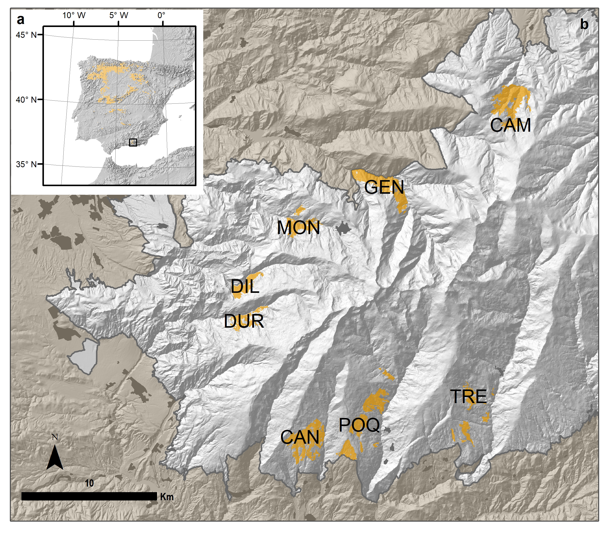
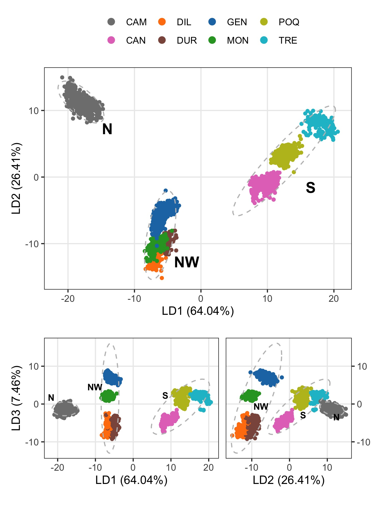

# Ecological diversity within rear-edge: a case study from Mediterranean *Quercus pyrenaica* Willd. {#sec-multivar}

> **Antonio J. Pérez-Luque**; Blas M. Benito; Francisco J. Bonet-García & Regino Zamora. 2021. *Forests*, 12(1): 10. [doi:10.3390/f12010010](https://dx.doi.org/10.3390/f12010010)

##### Abstract {.unnumbered}

Understanding the ecology of populations located in the rear-edge of their distribution is key to assess the response of the species to changing environmental conditions. Here we focus on rear-edge populations of *Quercus pyrenaica* in Sierra Nevada (southern Iberian Peninsula) to analyze their ecological and floristic diversity. We perform multivariate analyses using high-resolution environmental information and forest inventories to determine how environmental variables differ among oak populations, and to identify population groups based on environmental and floristic composition. We find that water availability is a key variable in explaining the distribution of *Q. pyrenaica* and the floristic diversity of their accompanying communities within its rear edge. Three cluster of oak populations were identified based on environmental variables. We found differences among these clusters regarding plant diversity, but no for forest attributes. A remarkable match between the populations clustering derived from analysis of environmental variables and the ordination of the populations according to species composition was found. The diversity of ecological behaviors for *Q. pyrenaica* populations in this rear edge are consistent with the high genetic diversity shown by populations of this oak in the Sierra Nevada. The identification of differences between oak populations within the rear-edge with respect to environmental variables can aid to plan the forest management and restoration actions, particularly considering the importance of some environmental factors in key ecological aspects.

## Introduction {#sec-multivar-intro}

The study of ecological dynamics within the rear edge populations is considered essential to establish proper management guidelines under current climate uncertainties [@Fadyetal2016EvolutionbasedApproach]. Rear-edge populations are often adapted to local environmental conditions at the limit of the species' ecological amplitude, and often show a long-term persistence [@HampePetit2005ConservingBiodiversity]. Local responses to environmental changes may differ from the species mean response [@Castroetal2004SeedlingEstablishment; @Benavidesetal2013DirectIndirect; @GeaIzquierdoCanellas2014LocalClimate; @Matiasetal2017ContrastingGrowth], and such differences may either promote or hamper the survival of edge populations under global change [@BenitoGarzonetal2011IntraspecificVariability]. Furthermore, the heterogeneity in the response to climate change observed across ecological and geographical gradients [@GeaIzquierdoetal2013GrowthProjections; @Chenetal2015InfluenceClimate; @DoradoLinanetal2019GeographicalAdaptation; @PerezLuqueetal2020LanduseLegacies], justifies the need to incorporate fine-scale variation of environment variables throughout species ranges to better understand species responses to global change [@DeFrenneetal2013MicroclimateModerates; @Oldfatheretal2020RangeEdges]. This is particularly important for mountain landscapes, where the topographic complexity may cause a decoupling between the climate and the geographic spaces [@ElsenTingley2015GlobalMountain; @Pirononetal2015GeographicClimatic].

The environmental heterogeneity (microclimate, geomorphology, topography, etc.) found in mountains allows the existence of a diverse plethora of ecological conditions at very fine spatial scales [@Hannahetal2014FinegrainModeling; @KornerSpehn2019HumboldtianView], offering an excellent opportunity to study ecological responses to future environmental changes [@SpehnKorner2009MountainLaboratory; @Kohleretal2014MountainsClimate; @Payneetal2017OpportunitiesResearch; @Zamoraetal2017GlobalChange]. Some tree species, such as *Pinus sylvestris* and *Quercus pyrenaica*, have their rear-edge populations located in mountainous areas of southern Europe. The topographic heterogeneity of such habitats, which act as microclimatic islands within a region of unsuitable climate for the persistence of these species, is likely to have a significant impact on persistence of these populations [@MeineriHylander2017FinegrainLargedomain]. In these areas, the climate variation controlled by topography [@Franklinetal2013ModelingPlant; @Potteretal2013MicroclimaticChallenges] is hard to capture, and the fine scales non-climate factors (both biotic and abiotic) can be at least as much relevant for species distribution as climate [@Loetal2010WordCaution] by modulating the direct effect of regional climate on individuals. Additionally, there are finer scale gradients nested within each mountain range, which reproduce rear, optimum and leading edge conditions making the interpretation of what is currently occurring in the so-called rear edge extremely complex [@Benavidesetal2013DirectIndirect; @Oldfatheretal2020RangeEdges]. When environmental conditions are homogeneous, similar responses are expected which facilitate future forecast. Conversely, if the environmental conditions are heterogeneous, we expect a variety of responses, which forces us to consider different future scenarios at a very fine spatial scale, since climate change sensitivities could strongly vary at local scales [@Lindneretal2010ClimateChange; @GeaIzquierdoCanellas2014LocalClimate; @Titoetal2020MountainEcosystems].

*Quercus pyrenaica* Willd. (Pyrenean oak) is a deciduous Mediterranean tree species widely distributed throughout south-western France and the Iberian Peninsula reaching their southern limit in mountain areas of northern Morocco [@Franco1990Quercus]. The rear-edge populations of this species are restricted to high-mountain areas where these populations persists as isolated nuclei with ecological conditions very different from those of the main distribution area. *Q. pyrenaica* is considered one of the Mediterranean trees with a higher sensitivity to climate change [@BenitoGarzonetal2008EffectsClimate; @GarciaValdesetal2013ChasingMoving]. Several studies analyzed the potential effects of climate change on distribution of this species at different spatio-temporal scales [@Benitoetal2011SimulatingPotential; @BenitoGarzonetal2008EffectsClimate; @BenitoGarzonetal2007PredictiveModelling; @Felicisimo2011ImpactosVulnerabilidad; @GeaIzquierdoetal2013GrowthProjections; @RuizBenitoetal2013PatternsDrivers; @RuizLabourdetteetal2013ChangesTree; @Urbietaetal2011MediterraneanPine] forecasting a decrease in the suitable area of this tree species, particularly in its southern range.

Considering that the conservation strategies for tree species need to take into account the peculiarities of the rear-edge populations [@HampePetit2005ConservingBiodiversity; @Fadyetal2016EvolutionbasedApproach; @Rehmetal2015LosingYour], and the high vulnerability to climate change of *Q. pyrenaica* [@GarciaValdesetal2013ChasingMoving], here we focus on the rear-edge populations of this species in the mountains of southern Iberian Peninsula to answer the question: Are the environmental conditions of the rear-edge populations of *Q. pyrenaica* in Sierra Nevada homogeneous?. The answer to this question may be useful to analyze how the predicted climate changes would impact the rear-edge population, providing valuable information for the development of efficient forest management and restoration plans. We selected rear-edge populations of *Q. pyrenaica* located in Sierra Nevada (Southern Iberian Peninsula), since peripheral forest tree populations located in mountain areas represent natural laboratories for resolving priority research questions [@Fadyetal2016EvolutionbasedApproach]. Particularly, we hypothesize that the rear-edge populations of *Q. pyrenaica* located in mountain areas are representative of different environmental conditions at local scale due to the strong topographic gradients available at the edge of its range. In this work we analyze whether these rear-edge populations inhabit similar environmental conditions. We also assess to what extent the environmental variability is matched by the floristic diversity of *Q. pyrenaica* forests. Specifically, the objectives of the work were: *(i)* to determine the most important environmental variables for the distribution of Pyrenean oak populations in Sierra Nevada; *(ii)* to identify groups of Pyrenean oak populations based on floristic composition and environmental conditions; and *(iii)* to unveil whether the rear-edge populations clustering according to environmental variables coincides with their grouping based on their floristic composition.

{#fig-multivar-location-map}

## Material and Methods {#sec-multivar-MatMet}

### Study area {#sec-multivar-StudyArea}

The study was conducted at the Sierra Nevada (Andalusia, SE Spain; Figure [\[fig:multivar:location-map\]](#fig:multivar:location-map){reference-type="ref" reference="fig:multivar:location-map"}), a mountainous region covering more than 2000 km^2^ with an elevation range of between 860 and 3482 *m.a.s.l.* The climate is Mediterranean, characterized by cold winters and hot summers, with a pronounced summer drought. The annual average temperature decreases in altitude from 12-16 °C below 1500 *m.a.s.l.* to 0 °C above 3000 *m.a.s.l.*. Annual precipitation ranges from less than 250 mm in the lowest areas of the mountain range to more than 700 mm in the highest peaks. Winter precipitation is mainly in the form of snow above 2000 *m.a.s.l.*. Additionally, the complex orography causes strong climatic contrasts between south and north-facing slopes. This mountain range is considered one of the most important biodiversity hotspots in the Mediterranean region [@Blancaetal1998ThreatenedVascular], hosting 105 endemic plant species for a total of 2353 taxa of vascular plants (33 

Table: Description of the *Q. pyrenaica* populations in Sierra Nevada. For elevation, minimum and maximum values are in brackets. The latitude and longitude coordinates referred to polygon centroid. {#tbl-multivar-tpop}

| llllllll@{}} Oak poulation | Code | River valley | Municipalities | Elevation (m) | Latitude | Longitude | Area (ha) |
| --- | --- | --- | --- | --- | --- | --- | --- |
| El Camarate | CAM | Alhama | Lugros | 1740 (1441-2026) | 37º 10' 29.49'' N | 3º 15' 24.33'' W | 457.15 |
| Robledal de San Juan | GEN | Genil | Güejar-Sierra | 1519 (1189-1899) | 37º 7' 29.63'' N | 3º 21' 54.60'' W | 395 |
| Loma de la Perdíz | MON | Monachil | Monachil | 1780 (1564-1990) | 37º 5' 54.87'' N | 3º 25' 46.65'' W | 204.55 |
| Umbría de la Dehesa de Dílar | DIL | Dílar | Dílar | 1764 (1478-1960) | 37º 3' 33.61'' N | 3º 28' 29.07'' W | 154.07 |
| Loma de Enmedio | DUR | Dúrcal | Dúrcal | 1824 (1530-2035) | 37º 1' 58.75'' N | 3º 28' 38.44'' W | 137.04 |
| El Robledal de Cáñar | CAN | Chico | Cáñar | 1687 (1366-1935) | 36º 57' 28.04'' N | 3º 25' 57.10'' W | 436.2 |
| Loma de la Matanza y Loma de Ramón | POQ | Poqueira | Soportújar, Pampaneira, Bubión, Capileira | 1740 (1214-1981) | 36º 57' 58.90'' N | 3º 22' 55.12'' W | 458.95 |
| Loma de los Lotes | TRE | Trevélez | Pórtugos, Busquístar | 1692 (1312-1963) | 36º 58' 37.38'' N | 3º 17' 25.75'' W | 197.92 |

*Quercus pyrenaica* is a deciduous species extending through southwestern France, the Iberian Peninsula and northern Morocco [@Franco1990Quercus]. The forests of this species reach their southernmost European limit in Andalusian mountains such as Sierra Nevada, where eight populations have been identified (Figure [\[fig:multivar:location-map\]](#fig:multivar:location-map){reference-type="ref" reference="fig:multivar:location-map"}a; Table [\[tab:multivar:tpop\]](#tab:multivar:tpop){reference-type="ref" reference="tab:multivar:tpop"}) on the basis of their isolated geographic locations in deep valleys separated by distances considerably longer than the average dispersal distances of the seeds by birds such as Eurasian jay (*Garrulus glandarius*) [@Gomez2003SpatialPatterns; @ValbuenaCarabanaetal2005GeneFlow]. They are distributed on siliceous soils both in the northwestern and southern slopes of the mountain range and are often associated to major river valleys. These oak woodlands represent a rear edge of their distribution [@HampePetit2005ConservingBiodiversity], containing high levels of intraspecific genetic diversity [@ValbuenaCarabanaGil2013GeneticResilience]. Their conservation status for southern Spain is "Vulnerable", and it is expected to suffer from climate change, potentially reducing its suitable habitats in the near future [@GeaIzquierdoetal2013GrowthProjections; @GeaIzquierdoetal2017RiskyFuture].

The distribution of *Q. pyrenaica* forests in Sierra Nevada was delimited using the updated version of the forest map of Sierra Nevada at 1:10 000 scale [@CMAOT2014CartografiaEvaluacion; @PerezLuqueetal2019MapEcosystems]. Black and white ortophotographies from 2001 (0.5-m of spatial resolution) and false color aerial photographies (Color Infrared) from 2005 (1-m resolution) were used to correct errors by detailed photographic interpretation, resulting in a detailed map of oak forests (Figure [\[fig:multivar:location-map\]](#fig:multivar:location-map){reference-type="ref" reference="fig:multivar:location-map"}b). Forest patches with at least 50  

### Environmental data {#sec-multivar-EnvData}

For each oak population we obtained the values of 30 environmental variables selected to represent different direct and indirect gradients important for plant distribution [@GuisanZimmermann2000PredictiveHabitat; @Williamsetal2012WhichEnvironmental]: temperature, water availability, topography, solar radiation and land-use (Table [\[tab:multivar:tvars\]](#tab:multivar:tvars){reference-type="ref" reference="tab:multivar:tvars"}). Observed climate data (1960-2010) from 43 meteorological stations 50 km around Sierra Nevada, compiled by Sierra Nevada Global Change Observatory [@Zamoraetal2017GlobalChange], were used as input to compute high resolution (100 x 100 m pixel-size) climate maps [@Benitoetal2014ClimateSimulations] based on the mapping method proposed by @Ninyerolaetal2000MethodologicalApproach. Seasonal and annual maps with the averages of direct solar radiation and insolation time were computing using the GIS GRASS module r.sun [@Neteleretal2012GRASSGIS; @SuriHofierka2004NewGISbased]. From a high-resolution digital elevation model (10-m; Department of the Environment, Regional Government of Andalusia) several topographic variables were derived: elevation, slope, aspect, E-W and N-S gradients, topographic position (difference in elevation between a cell and surrounding cells within a 1000 meter radius)[@Guisanetal1999GLMCCA]. Also, topographic wetness index and flow accumulation were computed using the r.terraflow module of GRASS GIS. As a surrogate of anthropogenic influence, we computed the frequency of human infrastructures in a 2000 meter radius buffer. Finally, for each environmental variable we extracted the values for all the 100 m size pixels contained within each oak population (Figure [\[fig:multivar:schemamulti\]](#fig:multivar:schemamulti){reference-type="ref" reference="fig:multivar:schemamulti"}).

Table: Description of environmental variables and forest attributes used in our analysis {#tbl-multivar-tvars}

| **Category** | **Code** | **Description** | **Units** |  |  |  |  |  |  |  |  |  |  |  |  |
| --- | --- | --- | --- | --- | --- | --- | --- | --- | --- | --- | --- | --- | --- | --- | --- |
| multirow{13}{*}{Climate} | precYE | Annual precipitation | mm |  |  |  |  |  |  |  |  |  |  |  |  |
|  | precSU | Summer precipitation | mm |  |  |  |  |  |  |  |  |  |  |  |  |
|  | precAU | Autumn precipitation | mm |  |  |  |  |  |  |  |  |  |  |  |  |
|  | precWI | Winter precipitation | mm |  |  |  |  |  |  |  |  |  |  |  |  |
|  | precSP | Spring precipitation | mm |  |  |  |  |  |  |  |  |  |  |  |  |
|  | tmaxSU | Summer mean maximum temperature | º C |  |  |  |  |  |  |  |  |  |  |  |  |
|  | tmaxAU | Autumn mean maximum temperature | º C |  |  |  |  |  |  |  |  |  |  |  |  |
|  | tmaxWI | Winter mean maximum temperature | º C |  |  |  |  |  |  |  |  |  |  |  |  |
|  | tmaxSP | Spring mean maximum temperature | º C |  |  |  |  |  |  |  |  |  |  |  |  |
|  | tminSU | Summer mean minimum temperature | º C |  |  |  |  |  |  |  |  |  |  |  |  |
|  | tminAU | Autumn mean minimum temperature | º C |  |  |  |  |  |  |  |  |  |  |  |  |
|  | tminWI | Winter mean minimum temperature | º C |  |  |  |  |  |  |  |  |  |  |  |  |
|  | tminSP | Spring mean minimum temperature | º C |  |  |  |  |  |  |  |  |  |  |  |  |
| hline multirow{16}{*}{Topography} | elev | Elevation | meter |  |  |  |  |  |  |  |  |  |  |  |  |
|  | aspect | Aspect | º |  |  |  |  |  |  |  |  |  |  |  |  |
|  | slope | Slope | º |  |  |  |  |  |  |  |  |  |  |  |  |
|  | tpNS | North-South gradient |  | tpEW | East-West gradient |  | radSU | Summer direct radiation | Whm |  |  |  |  |  |  |
|  | radAU | Autumn direct radiation | Whm |  |  |  |  |  |  |  |  |  |  |  |  |
|  | radWI | Winter direct radiation | Whm |  |  |  |  |  |  |  |  |  |  |  |  |
|  | radSP | Spring direct radiation | Whm |  |  |  |  |  |  |  |  |  |  |  |  |
|  | radhSU | Mean duration of insolation in Summer | hour |  |  |  |  |  |  |  |  |  |  |  |  |
|  | radhAU | Mean duration of insolation in Autumn | hour |  |  |  |  |  |  |  |  |  |  |  |  |
|  | radhWI | Mean duration of insolation in Winter | hour |  |  |  |  |  |  |  |  |  |  |  |  |
|  | radhSP | Mean duration of insolation in Spring | hour |  |  |  |  |  |  |  |  |  |  |  |  |
|  | twi | Topographic wetness index |  |  |  |  |  |  |  |  |  |  |  |  |  |
|  | tpos | Topographic position | meter |  |  |  |  |  |  |  |  |  |  |  |  |
|  | flow | Flow accumulation |  |  |  |  |  |  |  |  |  |  |  |  |  |
| hline Landscape | human | Anthropogenic influence | cells |  |  |  |  |  |  |  |  |  |  |  |  |
| hline multirow{9}{*}{Forest structure} | FCC | Forest canopy cover |  | FCCTree | Forest canopy cover of Tree |  | FCCShru | Forest canopy cover of Shrub |  | FCCHerb | Forest canopy cover of Herbaceous |  | CCshann | Canopy Cover diversity |  |
|  | heiTree | Tree Height | m |  |  |  |  |  |  |  |  |  |  |  |  |
|  | denTree | Density | trees $ha^{-1}$ |  |  |  |  |  |  |  |  |  |  |  |  |
|  | BA | Basal area | $mathrm{m^2 cdot h^{-1}}$ |  |  |  |  |  |  |  |  |  |  |  |  |
|  | vol | Volume | $mathrm{m^3 cdot h^{-1}}$ |  |  |  |  |  |  |  |  |  |  |  |  |
| hline multirow{2}{*}{Forest biodiversity} | diver | Plant diversity |  |  |  |  |  |  |  |  |  |  |  |  |  |
|  | rich | Richness | species number |  |  |  |  |  |  |  |  |  |  |  |  |
| hline multirow{3}{*}{Forest function} | regTot | Total regeneration | total seedling number |  |  |  |  |  |  |  |  |  |  |  |  |
|  | regQp | Pyrenean Oak regeneration | seedling number |  |  |  |  |  |  |  |  |  |  |  |  |
|  | regQi | Holm Oak regeneration | seedling number |  |  |  |  |  |  |  |  |  |  |  |  |

### Forest attributes {#sec-multivar-ForAtri}

To characterize oak patches, we selected several stand attributes relating to forest structure, function, and composition from Sierra Nevada Forest Inventory [@PerezLuqueetal2014SinfonevadaDataset] (Table [\[tab:multivar:tvars\]](#tab:multivar:tvars){reference-type="ref" reference="tab:multivar:tvars"}). By using this approach, we characterized the plant community both in terms of their species composition, and also regarding their ecological functioning [@McElhinnyetal2005ForestWoodland; @delRioetal2016CharacterizationStructure]. SINFONEVADA forest inventory was carried out during 2004-2005, and it includes an extensive network of plots distributed within the main forest units of Sierra Nevada mountain range. We selected 32 plots belonging to deciduous broadleaf forests category. All of them are located within the eight Pyrenean oak populations identified in Sierra Nevada. For each plot (20 x 20 m), all trees with diameter at breast height (dbh) \> 7.5 cm were tallied by species and dbh. Regeneration, species composition and abundance were also recorded in two additional subplots [@PerezLuqueetal2014SinfonevadaDataset]: a 5-m radius subplot where the seedling abundance of *Q. pyrenaica* was recorded; and a 10-m radius subplot where the species composition and abundance estimated by the Braun-Blanquet cover-abundance scale were measured [@BraunBlanquet1964PflanzensoziologieGrundzuge] (See Table [\[tab:multivar-s1\]](#tab:multivar-s1){reference-type="ref" reference="tab:multivar-s1"}).

Forest composition (richness) and plant diversity were used as indicator for overall forest biodiversity. Plant diversity was measured using the Shannon diversity index [@Krebs1999EcologicalMethodology]. The total regeneration was used as proxy for forest functioning. Finally, as forest structure indicators we selected the following attributes: the total- and strata- (*i.e.* tree, shrub and herbaceous) canopy cover; canopy cover diversity; tree height, tree density, basal area and volume of adult tree. Canopy covers were computed as the proportion of plot area covered by the whole forest (total) and the different strata considered (tree, shrub and herbaceous respectively). Canopy cover diversity was quantified through the Shannon index for the proportion of plot area covered by different vegetation strata (tree, shrub and herbaceous) according with the following equation: $$CCd'=\sum_{i=1}^{n} g_i \cdot \ln g_i$$ where $g_i$ is the proportion of strata $i$ of the total plot area and $n$ is the number of strata [@delRioetal2003IndicesStand]. Basal area was calculated as the sum of the basal areas of the adult trees assuming a circular cross-section of the trunk. Volume was calculated as sum of volume ($V = 0.55 \cdot \textrm{height} \cdot \textrm{diameter}^2$) of all *Q. pyrenaica* adult trees. Additionally, we also extracted the values of the environmental variables for the centroids of the plots and we added a species-composition matrix for each of the 32 selected plots.

![Methodological scheme of the analyses. Using an environmental data matrix, the main environmental gradients that characterize the oak forests at Sierra Nevada were identified using a Principal Component Analysis (PCA). Linear Discriminant Analysis (LDA) was also applied to identify different groups of oak populations. With a matrix of floristic composition, a Non-metric Multidimensional Scaling (NMDS) ordination were applied to visualize patterns of species composition, interpret them according to the environmental factors, and identify groups of oak populations based on similarities between floristic composition. See material and methods for more details.](img/multivariante/schema.png){#fig-multivar-schemamulti}

### Statistical analysis {#sec-multivar-Analysis}

To identify the main environmental gradients that characterize the oak forests at Sierra Nevada, we performed a principal component analysis (PCA) on the standardized variables (Figure [\[fig:multivar:schemamulti\]](#fig:multivar:schemamulti){reference-type="ref" reference="fig:multivar:schemamulti"}). Over 75  

Then, environmental variables and forest attributes were tested for differences among populations groups previously identified. Normality and homoscedasticity were checked using the Shapiro-Wilk test and Levene's test respectively. If normality and homoscedasticity assumptions were satisfied, we performed ANOVA analysis followed by the Tukey LSD for testing statistical significance. Otherwise, Kruskal-Wallis ANOVA for nonparametric data were conducted followed by manual pairwise comparison using Mann-Whitney U-test.

Finally we used a Non-metric Multidimensional Scaling (NMDS) ordination analysis based on Bray--Curtis dissimilarity distance [@Kruskal1964NonmetricMultidimensional] to: (*i*) visualize patterns of species compositions, (*ii*) interpret them with respect to the environmental factors (*i.e.* relate the variability in species composition to environmental variables), and (*iii*) identify groups of Pyrenean oak populations based on similarities between floristic composition. NMDS involves the reduction of multidimensional similarity data to a low-dimensional ordination in which relative distance indicates relative similarity (*i.e.* plots with very similar species composition are close and *vice versa*) [@Minchin1987SimulationMultidimensional]. We compared two and three-dimensional solutions based on Kruskal's stress (as a measure of goodness of fit). We also studied the floristic-environment relationships by fitting linear trends on the ordination yielded by the NMDS. For these linear fittings, squared correlation coefficients and empirical p-values were calculated using random permutations (n = 1000) of the data [@Oksanen2013MultivariateAnalysis]. Finally we fitted non-parametrically smoothed surfaces of continuous environmental variables on the NMDS ordination. The smooth surfaces were fitted using generalized additive models (GAM) with thin plate splines, using the coefficient of determination ($R^2$) as goodness-of-fit statistic [@Oksanen2013MultivariateAnalysis; @Virtanenetal2006BroadScale].

All analysis was conducted in R software [@base] using the following packages: MASS [@MASS], nFactors [@nFactors], and vegan [@vegan]. We also used the packages candisc [@candisc], ellipse [@ellipse], ggpubr [@ggpubr], ggord [@ggord], factoextra [@factoextra] and patchwork [@patchwork] for visualization.

## Results {#sec-multivar-Results}

PCA of all measured environmental variables yielded three significant axes explained 62.11  

Table: Results of the principal component and discriminant analysis. The three first axis for PCA and LDA are shown. Loadings and correlations of the environmental variables on principal component axis are reported. For LDA, canonical correlations of environmental variables with each discriminant function are shown. {#tbl-multivar-tpca}

| **Variable** | **PC1 load** | **PC1 cor.** | **PC2 load** | **PC2 cor.** | **PC3 load** | **PC3 cor.** | **LDA 1** | **LDA 2** | **LDA 3** |
| --- | --- | --- | --- | --- | --- | --- | --- | --- | --- |
| twi | -0.022 | -0.069 | -0.010 | -0.024 | 0.023 | 0.046 | -0.009 | 0.005 | 0.018 |
| flow | 0.024 | 0.073 | 0.011 | 0.026 | -0.008 | -0.015 | 0.004 | -0.003 | 0.005 |
| elev | -0.158 | -0.489 | -0.016 | -0.035 | 0.142 | 0.280 | 0.000 | -0.014 | 0.105 |
| slope | 0.222 | 0.690 | -0.068 | -0.155 | 0.157 | 0.309 | 0.032 | 0.034 | -0.073 |
| tpos | -0.163 | -0.507 | -0.019 | -0.042 | -0.043 | -0.085 | -0.021 | -0.013 | 0.006 |
| aspect | -0.210 | -0.650 | -0.012 | -0.026 | -0.087 | -0.172 | -0.044 | -0.043 | 0.075 |
| tpEW | 0.082 | 0.255 | 0.092 | 0.209 | -0.017 | -0.033 | 0.029 | 0.065 | 0.044 |
| tpNS | 0.238 | 0.737 | 0.031 | 0.070 | 0.092 | 0.182 | 0.076 | 0.070 | -0.070 |
| radWI | -0.270 | -0.836 | -0.030 | -0.067 | -0.101 | -0.198 | -0.071 | -0.076 | 0.081 |
| radSU | -0.276 | -0.857 | -0.023 | -0.051 | -0.119 | -0.235 | -0.067 | -0.077 | 0.084 |
| radSP | -0.287 | -0.889 | 0.031 | 0.071 | -0.152 | -0.299 | -0.045 | -0.059 | 0.090 |
| radAU | -0.292 | -0.906 | 0.005 | 0.011 | -0.141 | -0.279 | -0.056 | -0.069 | 0.090 |
| radhWI | -0.286 | -0.888 | -0.014 | -0.032 | -0.127 | -0.251 | -0.073 | -0.083 | 0.098 |
| radhSP | -0.283 | -0.878 | 0.024 | 0.054 | -0.150 | -0.295 | -0.051 | -0.054 | 0.101 |
| radhSU | -0.138 | -0.428 | 0.111 | 0.252 | -0.105 | -0.207 | -0.003 | 0.003 | 0.061 |
| radhAU | -0.190 | -0.590 | 0.096 | 0.218 | -0.112 | -0.220 | -0.018 | -0.003 | 0.074 |
| human | -0.143 | -0.443 | -0.069 | -0.156 | 0.165 | 0.326 | -0.067 | 0.013 | 0.107 |
| precWI | -0.191 | -0.593 | -0.178 | -0.404 | 0.301 | 0.594 | -0.081 | 0.024 | -0.076 |
| precSP | -0.178 | -0.551 | -0.068 | -0.153 | 0.264 | 0.520 | -0.044 | 0.087 | 0.074 |
| precSU | -0.226 | -0.702 | -0.084 | -0.190 | 0.243 | 0.479 | -0.073 | 0.069 | 0.092 |
| precAU | -0.223 | -0.692 | -0.173 | -0.391 | 0.225 | 0.444 | -0.157 | -0.043 | -0.074 |
| precYE | -0.223 | -0.692 | -0.145 | -0.329 | 0.274 | 0.539 | -0.092 | 0.032 | -0.001 |
| tminWI | 0.042 | 0.131 | -0.342 | -0.775 | -0.267 | -0.525 | 0.003 | -0.001 | -0.024 |
| tminSP | 0.036 | 0.110 | -0.293 | -0.664 | -0.311 | -0.613 | 0.007 | -0.008 | 0.001 |
| tminSU | 0.022 | 0.068 | -0.189 | -0.429 | -0.357 | -0.705 | 0.014 | -0.011 | 0.045 |
| tminAU | 0.035 | 0.109 | -0.276 | -0.625 | -0.321 | -0.633 | 0.009 | -0.009 | 0.008 |
| tmaxWI | 0.051 | 0.159 | -0.353 | -0.800 | 0.133 | 0.262 | -0.021 | 0.014 | -0.176 |
| tmaxSP | 0.063 | 0.196 | -0.355 | -0.804 | 0.091 | 0.180 | -0.009 | -0.014 | -0.155 |
| tmaxSU | 0.056 | 0.175 | -0.396 | -0.897 | 0.015 | 0.030 | -0.010 | 0.004 | -0.120 |
| tmaxAU | 0.054 | 0.166 | -0.372 | -0.843 | 0.100 | 0.196 | -0.018 | 0.011 | -0.160 |
| Eigenvalue | 9.618 |  | 5.130 |  | 3.886 |  | 150.351 | 67.162 | 19.108 |
| Variance | 32.061 |  | 17.100 |  | 12.953 |  | 61.780 | 27.597 | 7.851 |
| Cumulated variance | 32.061 |  | 49.161 |  | 62.114 |  | 61.780 | 89.378 | 97.229 |
| Canonical correlation |  |  |  |  |  |  | 0.997 | 0.993 | 0.975 |

{#fig-figure-6}

The discriminant analysis yielded three significant functions explaining 97.9  

The three oak clusters showed significantly differences for most of the environmental variables analyzed (Table [\[tab:multivar:tanovas\]](#tab:multivar:tanovas){reference-type="ref" reference="tab:multivar:tanovas"}). Only winter minimum temperatures ($\chi^2$ = 5.35; p-value = 0.069) and insolation time during summer ($\chi^2$ = 0.306; p-value = 0.306)) was similar among the three oak clusters (Table [\[tab:multivar:tanovas\]](#tab:multivar:tanovas){reference-type="ref" reference="tab:multivar:tanovas"}). *Post-hoc* analysis showed that for most of the environmental variables we found pairwise significant differences between all the three oak clusters (Table [\[tab:multivar:tanovas\]](#tab:multivar:tanovas){reference-type="ref" reference="tab:multivar:tanovas"}).

Forest attributes did not significantly differ among the above described oak clusters except for plant diversity and herbaceous canopy cover (Table [\[tab:multivar:tanovas\]](#tab:multivar:tanovas){reference-type="ref" reference="tab:multivar:tanovas"}). The N cluster showed higher value of Shannon diversity index (2.27 ± 0.17) than NW cluster (*Mann-Whitney U* = 22.0; p-value \<0.01). For stand attributes relating to forest structure only the herbaceous canopy cover showed significantly differences ($\chi^2$ = 11.18; p-value = 0.004; Table [\[tab:multivar:tanovas\]](#tab:multivar:tanovas){reference-type="ref" reference="tab:multivar:tanovas"}) between N and NW clusters (*Mann-Whitney U* = 15.0; p-value \< 0.01). For all other forest structure attributes, despite there are no significant differences, the N cluster showed the lowest values (Table [\[tab:multivar:tanovas\]](#tab:multivar:tanovas){reference-type="ref" reference="tab:multivar:tanovas"}). No significant differences were recorded for regeneration variables.

Table: Mean values of environmental variables and forest attributes for the three identified clusters of *Q. pyrenaica* forests derivated from the discriminant anaylisis. The Chi-squared statistics of the nonparametric Kruskal-Wallis test is shown except for those variables analyzed using ANOVA test (*fccShru*, *fccTree* and *rich*). Values within brackets correspond to standard errors. Standard erros are shown in parentheses. Different letters indicate statistically significant differences between clusters oak populations. {#tbl-multivar-tanovas}

| **variable** | **statistic** | **p.value** | **d.f.** | **groupA (N)** | **groupB (NW)** | **groupC (S)** |
| --- | --- | --- | --- | --- | --- | --- |
| BA | 4.43 | 0.109 | 2 | 0.71 (0.47) a | 7.11 (2.00) ab | 7.71 (2.78) b |
| denTree | 3.17 | 0.204 | 2 | 61.57 (31.95) a | 226.97 (65.10) a | 282.47 (86.03) a |
| fccHerb | 11.18 | 0.004 | 2 | 6.50 (0.60) a | 2.83 (0.51) b | 4.33 (1.12) ab |
| fcc | 4.45 | 0.108 | 2 | 7.50 (0.57) a | 8.50 (0.54) a | 8.67 (0.99) a |
| heiTree | 1.15 | 0.563 | 2 | 4.19 (1.67) a | 6.96 (1.83) a | 7.45 (1.76) a |
| CCShann | 2.09 | 0.352 | 2 | 0.85 (0.06) a | 0.92 (0.04) a | 0.93 (0.04) a |
| vol | 3.63 | 0.163 | 2 | 7.50 (4.92) a | 90.05 (29.24) a | 76.66 (34.22) a |
| fccShru | 1.96 | 0.159 | 2,29 | 2.75 (0.86) a | 4.50 (0.51) a | 5.33 (1.54) a |
| fccTree | 1.41 | 0.261 | 2,29 | 1.75 (0.62) a | 3.33 (0.58) a | 2.67 (0.80) a |
| regTot | 0.18 | 0.913 | 2 | 19.38 (6.25) a | 47.56 (16.16) a | 32.67 (15.82) a |
| regQi | 3.89 | 0.143 | 2 | 5.75 (3.40) a | 0.17 (0.09) a | 3.50 (2.08) a |
| regQp | 0.39 | 0.823 | 2 | 7.62 (3.21) a | 46.39 (16.16) a | 29.17 (16.30) a |
| diver | 8.67 | 0.013 | 2 | 2.27 (0.17) a | 1.57 (0.13) b | 1.83 (0.09) ab |
| rich | 2.95 | 0.068 | 2,29 | 16.62 (1.95) a | 11.72 (1.21) a | 14.17 (0.70) a |
| flow | 66.22 | 0.000 | 2 | 345.35 (97.91) a | 175.73 (32.95) b | 169.57 (21.93) c |
| twi | 60.74 | 0.000 | 2 | 4.90 (0.08) a | 5.08 (0.05) b | 5.40 (0.05) c |
| elev | 32.38 | 0.000 | 2 | 1740.05 (6.52) a | 1669.84 (6.22) b | 1710.33 (4.20) c |
| tpEW | 442.28 | 0.000 | 2 | 40.37 (1.47) a | 54.36 (0.84) b | 28.34 (0.58) c |
| tpos | 201.90 | 0.000 | 2 | -22.52 (1.73) a | -22.46 (1.64) a | -1.25 (0.75) b |
| aspect | 656.80 | 0.000 | 2 | 160.25 (5.50) a | 113.33 (2.33) b | 262.06 (3.14) c |
| slope | 568.14 | 0.000 | 2 | 26.10 (0.33) a | 29.93 (0.28) b | 20.32 (0.25) c |
| radWI | 1301.22 | 0.000 | 2 | 1489.98 (50.78) a | 770.18 (31.99) b | 3013.85 (25.28) c |
| radAU | 1238.90 | 0.000 | 2 | 5854.49 (40.75) a | 5205.08 (30.85) b | 6808.90 (17.59) c |
| radSU | 1242.79 | 0.000 | 2 | 3056.60 (59.95) a | 2140.28 (41.68) b | 4619.39 (26.39) c |
| radSP | 1064.83 | 0.000 | 2 | 6835.85 (29.69) a | 6352.91 (25.49) b | 7419.43 (14.46) c |
| radhWI | 1565.28 | 0.000 | 2 | 4.77 (0.10) a | 2.98 (0.08) b | 8.10 (0.05) c |
| radhAU | 125.57 | 0.000 | 2 | 10.44 (0.05) a | 10.37 (0.04) a | 11.01 (0.03) b |
| radhSP | 1117.91 | 0.000 | 2 | 7.42 (0.06) a | 6.47 (0.06) b | 9.13 (0.04) c |
| radhSU | 2.36 | 0.307 | 2 | 11.49 (0.05) a | 11.37 (0.04) a | 11.58 (0.03) a |
| tpNS | 1363.86 | 0.000 | 2 | 62.33 (0.93) a | 73.73 (0.66) b | 27.76 (0.54) c |
| dist | 2094.16 | 0.000 | 2 | 47.10 (0.04) a | 39.52 (0.11) b | 25.26 (0.04) c |
| human | 983.67 | 0.000 | 2 | 0.00 (0.00) a | 6.95 (0.38) b | 19.53 (0.45) c |
| precYE | 1143.00 | 0.000 | 2 | 690.32 (1.66) a | 741.43 (1.10) b | 778.13 (0.95) c |
| precWI | 926.56 | 0.000 | 2 | 233.38 (0.43) a | 246.53 (0.27) b | 253.85 (0.28) c |
| precAU | 1703.96 | 0.000 | 2 | 253.82 (0.45) a | 267.02 (0.29) b | 290.49 (0.35) c |
| precSP | 576.54 | 0.000 | 2 | 135.36 (0.39) a | 148.30 (0.32) b | 148.28 (0.21) c |
| precSU | 847.35 | 0.000 | 2 | 67.76 (0.39) a | 79.57 (0.32) b | 85.51 (0.20) c |
| tmaxWI | 184.76 | 0.000 | 2 | 8.22 (0.05) a | 9.40 (0.05) b | 9.16 (0.04) c |
| tmaxAU | 170.76 | 0.000 | 2 | 16.22 (0.05) a | 17.19 (0.05) b | 16.97 (0.04) c |
| tmaxSP | 46.60 | 0.000 | 2 | 13.95 (0.04) a | 14.35 (0.04) b | 14.21 (0.03) c |
| tmaxSU | 87.50 | 0.000 | 2 | 24.93 (0.04) a | 25.46 (0.04) b | 25.29 (0.03) c |
| tminWI | 5.35 | 0.069 | 2 | 0.45 (0.04) a | 0.42 (0.02) a | 0.37 (0.02) a |
| tminAU | 28.56 | 0.000 | 2 | 7.15 (0.04) a | 6.93 (0.02) b | 6.89 (0.02) b |
| tminSP | 18.45 | 0.000 | 2 | 4.55 (0.04) a | 4.37 (0.02) b | 4.35 (0.02) b |
| tminSU | 80.11 | 0.000 | 2 | 13.13 (0.04) a | 12.68 (0.03) b | 12.68 (0.03) b |

A three-dimensional solution of the NMDS was chosen because its correlation with the original data was higher than for a two-dimensional solution (Linear fit $R^2$=0.793 *vs.* 0.713). Additionally, lower Kruskal's stress value was observed for the three-dimensional solution (Stress=0.159 *vs.* 0.226). The NMDS ordination of the forest stands according to their floristic composition was significantly correlated with precipitation variables, elevation and marginally with winter maximum temperatures (Figure [\[fig:multivar:nmds\]](#fig:multivar:nmds){reference-type="ref" reference="fig:multivar:nmds"}; Table [\[tab:multivar:nmds\]](#tab:multivar:nmds){reference-type="ref" reference="tab:multivar:nmds"}). The precipitation variables showed highly and negative correlations with NMDS axis 2 (Table [\[tab:multivar:nmds\]](#tab:multivar:nmds){reference-type="ref" reference="tab:multivar:nmds"}). The NMDS axis 1 were negatively correlated with elevation ($R^2$ = 0.464) and minimum temperatures, and positively correlated with slope and winter maximum temperatures (Table [\[tab:multivar:nmds\]](#tab:multivar:nmds){reference-type="ref" reference="tab:multivar:nmds"}). The NMDS ordinations with fitted vectors and surfaces for significant variables are shown in Figure [\[fig:multivar:surfaces\]](#fig:multivar:surfaces){reference-type="ref" reference="fig:multivar:surfaces"}. All these variables showed a non-linear significant relationship with the ordination pattern ($R^2$ values for surfaces were slightly higher than linear $R^2$ values; Table [\[tab:multivar:nmds\]](#tab:multivar:nmds){reference-type="ref" reference="tab:multivar:nmds"}).

![NMDS ordination of the plots. Points represent plot sites displayed according to their similarity in species composition. Proximity in the statistical space indicates plot sites with a similar species composition. Arrows represent vectors of significantly environmental variables explaining the ordination (see Table~ref{tab:multivar:nmds}). Each plot coloured according to the three oak-populations clusters derived from discriminant analysis. Only two dimensions of the NMDS is illustrated for ease of representation.](img/multivariante/nmds.png){#fig-multivar-nmds}

## Discussion {#sec-multivar-Discussion}

### Ecological diversity within the rear-edge {#sec-multivar-EcolDiversity}

The rear-edge populations of *Quercus pyrenaica* located in mountain areas are not ecologically homogeneous, neither for their environmental conditions nor for their plant species composition. In this study, we find separate groups of *Q. pyrenaica* populations within Sierra Nevada (rear-edge) driven by radiation and rainfall as main discriminant variables (Figure [\[fig:multivar:lda\]](#fig:multivar:lda){reference-type="ref" reference="fig:multivar:lda"}). The differences among populations based on environmental variables, are in line with differential ecological dynamics reported for *Q. pyrenaica* forests in the Sierra Nevada by other studies. For instance, primary productivity of these forest measured using remote sensing showed a heterogeneous spatial behavior, with oak woodlands of the southern slopes displaying a greater annual vegetation greenness than those from the northern slopes [@Dionisioetal2012SatelliteBasedMonitoring; @PerezLuqueetal2015OntologicalSystem; @PerezLuqueetal2020LanduseLegacies]. Also, differences have been found in both seasonal dynamics of greenness [@Dionisioetal2012SatelliteBasedMonitoring], and in temporal trends for primary productivity in the last years related with differential snow-cover trends in contrasting slopes [@PerezLuqueetal2015OntologicalSystem; @AlcarazSeguraetal2016ChangesVegetation].

{#fig-multivar-surfaces}

Table: Results of the NMDS. Maximum linear correlations ($R^2$) of the environmental variables (vector) with the NMDS ordination patterns are shown. Significance of the correlations was calculated using 1000 permutations. Non-linear surface responses using GAM are also shown {#tbl-multivar-nmds}

| ** ** | **Vector** | **Response Surface** |  |  |  |
| --- | --- | --- | --- | --- | --- |
| Variable | Vector $R^2$ | Vector p-value | F | Response Surface $R^2$ | p-value |
| precWI | 0.583 | 0.001 | 4.89 | 0.587 | 0.000 |
| precSP | 0.509 | 0.001 | 6.23 | 0.644 | 0.000 |
| precSU | 0.584 | 0.001 | 7.76 | 0.693 | 0.000 |
| precAU | 0.526 | 0.001 | 2.93 | 0.460 | 0.000 |
| precYE | 0.613 | 0.001 | 6.14 | 0.640 | 0.000 |
| tminWI | 0.071 | 0.547 | 0.73 | 0.175 | 0.106 |
| tminSP | 0.091 | 0.436 | 0.63 | 0.155 | 0.121 |
| tminSU | 0.138 | 0.223 | 0.51 | 0.130 | 0.140 |
| tminAU | 0.101 | 0.384 | 0.54 | 0.137 | 0.144 |
| tmaxWI | 0.234 | 0.047 | 3.21 | 0.483 | 0.001 |
| tmaxSP | 0.112 | 0.363 | 0.87 | 0.202 | 0.069 |
| tmaxSU | 0.206 | 0.081 | 1.78 | 0.341 | 0.014 |
| tmaxAU | 0.225 | 0.057 | 2.97 | 0.463 | 0.002 |
| human | 0.127 | 0.277 | 0.14 | 0.040 | 0.319 |
| twi | 0.057 | 0.649 | 0.52 | 0.131 | 0.133 |
| flow | 0.032 | 0.830 | 0.00 | 0.000 | 0.604 |
| elev | 0.464 | 0.002 | 5.12 | 0.598 | 0.000 |
| slope | 0.053 | 0.631 | 0.14 | 0.040 | 0.293 |
| tpos | 0.131 | 0.261 | 0.27 | 0.072 | 0.232 |
| aspect | 0.050 | 0.696 | 0.00 | 0.000 | 0.646 |
| tpEW | 0.050 | 0.698 | 0.34 | 0.090 | 0.217 |
| tpNS | 0.008 | 0.970 | 0.31 | 0.081 | 0.211 |
| radWI | 0.021 | 0.899 | 0.12 | 0.034 | 0.326 |
| radSU | 0.017 | 0.918 | 0.00 | 0.000 | 0.841 |
| radSP | 0.024 | 0.864 | 0.00 | 0.000 | 0.580 |
| radAU | 0.014 | 0.937 | 0.00 | 0.000 | 0.660 |
| radhWI | 0.028 | 0.837 | 0.05 | 0.014 | 0.384 |
| radhSP | 0.038 | 0.782 | 0.00 | 0.000 | 0.613 |
| radhSU | 0.139 | 0.190 | 0.01 | 0.004 | 0.421 |
| radhAU | 0.115 | 0.280 | 0.19 | 0.052 | 0.274 |

Interestingly, our results also showed differences in species diversity among population groups derived from clustering based on environmental variables. These results are consistent with those provided by @Loriteetal2008PhytosociologicalReview, who pointed out that differences observed for the floristic component in the *Q. pyrenaica* populations of Sierra Nevada are related to the microclimatic conditions. Thus, the oak woodlands located in the northern of Sierra Nevada showed greater floristic similarity with those located at the center of the *Q. pyrenaica* distribution than those located at southern slopes of Sierra Nevada (geographically closer) [@Loriteetal2008PhytosociologicalReview]. The floristic differences between Sierra Nevada oak populations could also be related to the anthropogenic impact suffered by those populations, since the anthropic disturbances can affect the floristic patterns of the woodlands of this species, as it has been documented for oak woodlands in central Spain [@Gavilanetal2000EffectsDisturbance]. Thus, the CAM oak population (N-cluster) showed both the highest plant species diversity and richness (Table [\[tab:multivar:tanovas\]](#tab:multivar:tanovas){reference-type="ref" reference="tab:multivar:tanovas"} and Supplementary), which may be related to a better conservation status, as this populations has been less exposed to intense anthropogenic activity [@JimenezOlivencia1991PaisajesSierra]. Conversely, the southern oak populations (CAN, POQ and TRE) showed a poorer floristic composition conditioned by both climate and intense land use [@CamachoOlmedoetal2002DinamicaEvolutiva; @AlAallalietal1998EstudioVegetacion].

We found a remarkable match between the population's clustering derived from analysis of environmental variables (Figure [\[fig:multivar:lda\]](#fig:multivar:lda){reference-type="ref" reference="fig:multivar:lda"}) and the ordination of the populations according to species composition (Figure [\[fig:multivar:nmds\]](#fig:multivar:nmds){reference-type="ref" reference="fig:multivar:nmds"} and Figure [\[fig:multivar:surfaces\]](#fig:multivar:surfaces){reference-type="ref" reference="fig:multivar:surfaces"}). These findings suggest a linkage between the heterogeneity of environmental factors and the variability of species composition for these woodlands. The diversity of ecological conditions for *Q. pyrenaica* populations in this rear edge are in line with the high levels of genetic diversity shown by populations of this oak in the Sierra Nevada [@ValbuenaCarabanaGil2013GeneticResilience; @ValbuenaCarabanaGil2017CentenaryCoppicing]. The climatic and topographical heterogeneity that exists in the Sierra Nevada offers a great diversity of microhabitats, which has allowed this mountain range to act as a refuge for different species [@MedailDiadema2009GlacialRefugia; @GomezLunt2007RefugiaRefugia; @BlancoPastoretal2019TopographyExplains], including for deciduous *Quercus* species during the last glacial period [@Breweretal2002SpreadDeciduous; @Olaldeetal2002WhiteOaks; @RodriguezSanchezetal2010TreeRange]. In fact, there are fossil and genetic evidences for different *Quercus* species that strongly suggest they survived only in southerly refugia during the last glacial maximum [@Breweretal2002SpreadDeciduous; @Petitetal2002IdentificationRefugia; @BhagwatWillis2008SpeciesPersistence; @BirksWillis2008AlpinesTrees]. The persistence in a refugium suggests a combination of a moderately suitable local environment buffering against the regional climate, and a relative tolerance to climate change, by either pronounced phenotypic plasticity, and/or adaptive capacity [@Gavinetal2014ClimateRefugia]. This could be very well the case of *Q. pyrenaica*, a species harboring a high genetic diversity [@ValbuenaCarabanaGil2013GeneticResilience], located in a mountain region with a complex topography that could protect local populations against rapid climate shifts and allow species to persist despite regionally unfavorable environments.

### The importance of summer rainfall at the micro-habitat level. {#sec-multivarSummerRainfall}

The distribution of *Q. pyrenaica* is known to be conditioned by summer drought period with a minimum of 100-150 mm of summer rainfall [@BlancoCastroetal2005BosquesIbericos; @GarciaJimenez20099230Robledales]. Bioclimatic analysis for this species revealed the importance of rainfall and ombrothermic indexes in the separation of temperate and Mediterranean forests [@delRioetal2007BioclimaticAnalysis]. At more detailed scale, the distribution for this oak is driven by a complex gradient related with temperature, rainfall and radiation [@Gavilanetal2007ModellingCurrent; @Urbietaetal2011MediterraneanPine]. Our study unveils a separation in the environmental space between oak populations at the rear-edge related with the spatial pattern of precipitation for this mountain region [@Pereiraetal2016SpatialInterpolation]. Thus, summer and annual rainfall are among the most important factors in explaining the distribution of *Q. pyrenaica* forests in Sierra Nevada ( Table [\[tab:multivar:tpca\]](#tab:multivar:tpca){reference-type="ref" reference="tab:multivar:tpca"}). The northern and northwestern populations of *Q. pyrenaica* at Sierra Nevada are located in valley bottoms with and northern orientation, where the relative humidity is greater as result of a lower solar radiation. On the other hand, the populations of the southern slopes of Sierra Nevada get an extra supply of water from moist air from the neighboring Alborán sea [@MartinezParrasMoleroMesa1982EcologiaFitosociologia]. The differences in water availability among oak populations could affect several ecological processes such as tree-growth [@GeaIzquierdoCanellas2014LocalClimate; @PerezLuqueetal2020LanduseLegacies], seedling germination and survival [@Gomez2003ImpactVertebrate; @GomezAparicioetal2008OakSeedling; @Mendozaetal2009SeedingExperiment], and the regeneration of the species [@Gomezetal2001ProblemasRegeneracion], mainly due to the key role of water availability in the microsites facilitating the germination and establishment of seedlings.

### Implications for forecasting and modelling. {#sec-multivar-ImplicaForecast}

The factors controlling species distributions may vary depending on the scale of observation. At large scale areas, the distribution of a species is likely to be controlled by climatic regulators [@GuisanThuiller2005PredictingSpecies], whereas at local scales factors related to biological interactions play a relevant role in shaping species distributions [@Urbietaetal2008SoilWater; @SanchezdeDiosetal2009PresentFuture]. At the site level, we found that moisture availability is the environmental factor that better separates the studied oak populations into clearly differentiated clusters. The identification of different population groups based on environmental variables at fine-scale is important when modelling the distribution and forecasting the impact of global change on the species. Our results suggest that incorporating the local adaptations of individual populations into predictive models might help avoid misrepresenting the potential range shift of species under changing climate conditions [@BenitoGarzonetal2011IntraspecificVariability]. This is particularly important for species with rear-edges located in mountain ranges, since these areas provide a broad diversity of microhabitats due to climatic and topographical heterogeneity [@MedailDiadema2009GlacialRefugia]. For instance, some recent works have performed out high-resolution models of the distribution of relict trees in Mediterranean southern mountains (*e.g*. *Abies pinsapo*, *Pinus sylvetris* and *P. nigra*) providing useful information for forest management actions [@LopezTiradoHidalgo2014HighResolution].

## Concluding remarks: biodiversity from the genetics to the landscape. {#sec-multivar-Conclusion}

We identified several groups of oak populations within the rear-edge of the *Q. pyrenaica* forest mainly due to microhabitats conditions. The different clusters of oak populations are supported both by discriminant analysis of environmental variables and by ordination analysis based on the floristic composition on the target populations. The diversity in the ecological conditions within these populations results from both to the environmental heterogeneity created by the slopes and the contrasting exposures of the valleys they inhabit, and the anthropic use of these ecosystems [@NavarroGonzalezetal2013WeightLanduse; @PerezLuqueetal2020LanduseLegacies]. The confluence of these factors generates a multitude of environmental conditions on a fine scale, which are reflected in the distribution, composition and functioning of the *Quercus pyrenaica* forests. *Quercus pyrenaica* woodlands are highly diverse at all organization levels, from a genetic perspective, *i.e.* high levels of genetic differentiation within specie [@ValbuenaCarabanaGil2013GeneticResilience] and differences between populations [@ValbuenaCarabanaGil2011EvaluacionEstructura]; to ecosystem-functioning level, *i.e.* diversity in terms of primary production and growth [@PerezLuqueetal2015OntologicalSystem; @AlcarazSeguraetal2016ChangesVegetation], and diversity of resilience to disturbances [@PerezLuqueetal2020LanduseLegacies]. Such ecological heterogeneity is also made evident by the accompanying plant communities, which are very different depending on the oak population considered, being such differences correlated with the differences in environmental conditions among populations.

Mountains such as Sierra Nevada, not only act an elevation gradients along which plant communities are distributed and replaced, in fact, they constitute an ecological mosaics in which others factors besides elevation, *e.g.* the exposure and the history of human management, create a broad range of responses from the oak woodlands and its very diverse associated vegetation, from genetics to landscape. Understanding the differences that exist between oak populations within the rear-edge with respect to environmental variables help us to plan both the forest management and restoration actions, especially taking into account the importance of some environmental factors in key ecological aspects [@GomezAparicioetal2008OakSeedling; @PerezLuqueetal2020LanduseLegacies]. Our results also shows the importance of the rear-edge mountain areas as a refuges for within-species diversity, and the role of species' southern ranges as hotspots of within-species diversity [@Jumpetal2010MonitoringManaging; @HampeJump2011ClimateRelicts]. All this knowledge will be important to prioritize the conservation measures, and to design adaptive management actions targeting these populations, in order to maintain their ecological processes and biodiversity.
